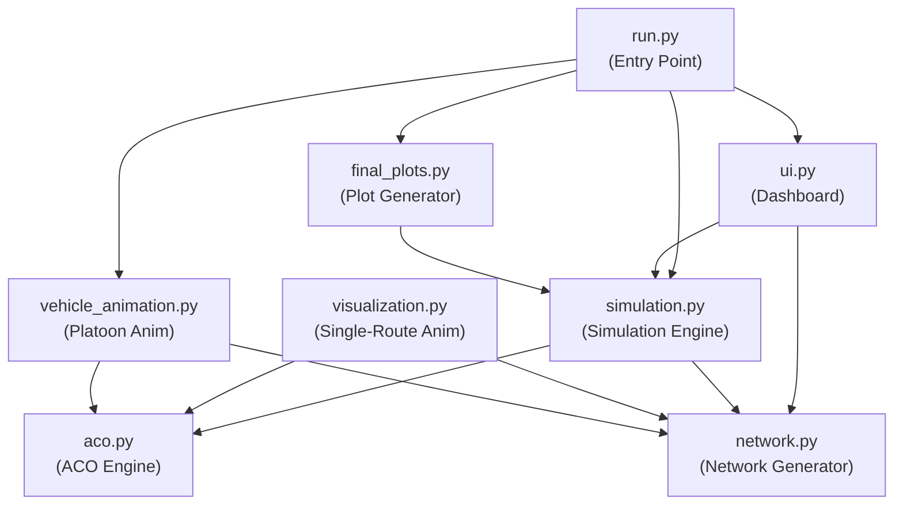

# Adaptive Smart ACO Based Robust Communication for Vehicle Platooning using Spider-Web Topology

## Complete Technical Report — From Zero to Engineering Mastery

---

# SECTION 1 — BIG PICTURE

---

## 1.1 What Is Vehicle Platooning?

Imagine you are driving on a highway. You see five trucks driving very close to each other in a single lane, maintaining perfect spacing — 5 metres apart — moving at the same speed, braking at the same time, accelerating together. No human driver could maintain this precision. These trucks are communicating with each other wirelessly, hundreds of times per second.

This is **vehicle platooning**.

**Definition**: Vehicle platooning is a technique where a group of vehicles travel together as a single coordinated unit. One vehicle acts as the **leader** (master), and the remaining vehicles are **followers**. The leader makes driving decisions (speed, braking, lane changes), and these decisions are transmitted to every follower vehicle via wireless communication. Each follower vehicle receives these commands and adjusts its behaviour automatically.

**Real-world analogy**: Think of a train. A train has one engine (the leader) and multiple coaches (followers). The coaches don't need their own engines because the lead engine pulls them all. In a vehicle platoon, the "pulling" is done through **communication** instead of physical coupling. The leader "pulls" the followers by sending them instructions wirelessly.

**Why does this matter?**

1. **Fuel efficiency**: When vehicles drive very close together, the vehicles behind experience less air resistance (aerodynamic drafting). Studies show platooning reduces fuel consumption by 10–20%.
2. **Road capacity**: Platoons take up less road space because vehicles maintain tighter spacing than human drivers can safely achieve. A highway that normally carries 2,000 vehicles per hour could carry 4,000+ with platooning.
3. **Safety**: Machines react faster than humans. A human takes ~1.5 seconds to react to the vehicle ahead braking. An electronic system reacts in ~0.1 seconds. This prevents chain-reaction crashes.
4. **Emissions reduction**: Less fuel burned means fewer CO₂ emissions.

---

## 1.2 Why Do Autonomous Vehicles Need Communication?

Consider this scenario: You are the third truck in a platoon of five trucks. The lead truck sees a pothole 200 metres ahead. It needs to tell every truck behind it: "Slow down and move slightly left."

Without communication, each truck would only react when it physically sees the pothole — by which time it might be too late for the last truck. With communication, the lead truck sends a message, and **all trucks receive it simultaneously** and begin adjusting at the same time.

This communication is called **V2V (Vehicle-to-Vehicle) communication**.

**What information is communicated?**

| Data Type | Example | Frequency |
|---|---|---|
| Speed command | "Maintain 80 km/h" | 10–50 times/second |
| Brake command | "Apply 30% braking force" | Immediate (event-driven) |
| Steering command | "Adjust heading 2° left" | 10–50 times/second |
| Position data | GPS coordinates | 10 times/second |
| Sensor data | "Obstacle detected at 150m" | Event-driven |
| Status data | "Battery at 72%, tyre pressure OK" | 1 time/second |

If even **one** of these messages fails to arrive, the consequences can be catastrophic. Imagine the lead truck brakes hard, but the third truck never receives the brake command. A collision at 80 km/h is now inevitable.

---

## 1.3 What Real-World Problem Exists?

The fundamental problem is this: **wireless communication is unreliable**.

Unlike a wired connection (like an Ethernet cable plugged into your computer), wireless signals face:

1. **Signal interference**: Other vehicles, buildings, radio towers, even weather can disrupt wireless signals.
2. **Signal fading**: As vehicles move, the signal strength between them changes constantly. A truck that had perfect signal 2 seconds ago might have no signal now because a bridge pillar came between them.
3. **Packet loss**: Digital messages are sent as "packets" of data. Some packets get corrupted or lost during transmission. On a good day, 1–5% of packets are lost. In bad conditions, 20–40% can be lost.
4. **Latency**: Even when a message arrives, it takes time. If a brake command takes 500 milliseconds to arrive instead of 50 milliseconds, the truck travels an extra 11 metres before braking at 80 km/h.
5. **Node failure**: A vehicle's communication hardware can fail. Its antenna can break, its radio module can overheat, its software can crash.

**What happens when communication fails in a platoon?**

- **Scenario 1**: Leader brakes → Message lost → Follower crashes into leader.
- **Scenario 2**: Leader changes lane → Message delayed by 2 seconds → Follower drifts into adjacent lane unsafely.
- **Scenario 3**: Communication module of Vehicle 3 fails → Vehicles 4, 5, 6 (behind it) lose all contact with the leader → Platoon splits, causing confusion for surrounding traffic.

---

## 1.4 Why Do Current Systems Fail?

Most existing vehicle platooning systems use a **star topology** for communication. In a star topology, every vehicle communicates directly with the leader. The leader is the central hub.

```
        S1
        |
   S2 — M — S3
        |
        S4
```

**Problem 1 — Single point of failure**: If the leader's communication module fails, **every** follower loses contact. The entire platoon is blind.

**Problem 2 — Range limitation**: In a long platoon (10+ vehicles), the last vehicle might be 100+ metres from the leader. Direct wireless communication at that distance is unreliable, especially in urban environments with buildings blocking the signal.

**Problem 3 — No alternate routes**: If the direct link between Vehicle M (master) and Vehicle S6 fails, there is no backup path. The message simply does not arrive.

**Problem 4 — Congestion**: When all 6 followers try to communicate with the leader simultaneously, the leader's radio becomes a bottleneck. Messages queue up, latency increases, and some are dropped.

---

## 1.5 What Exact Problem Does This Project Solve?

This project solves the **reliable communication routing problem** in vehicle platoons.

Specifically, it answers this question:

> *"Given a platoon of vehicles connected in a mesh-like network where links can fail, become congested, or experience variable latency — how do we find the best route to send a message from the master vehicle to any follower vehicle, such that the message has the highest probability of arriving quickly and reliably?"*

The solution has two parts:

1. **Spider-Web Topology**: Instead of a star topology (one central hub), vehicles are connected in a mesh network inspired by the structure of a spider's web. Multiple paths exist between any two vehicles. If one path fails, another path is immediately available.

2. **Ant Colony Optimization (ACO)**: Instead of using a fixed routing algorithm (like always taking the shortest path), the system uses an algorithm inspired by how real ants find food. The algorithm learns over time which paths are reliable and fast, and dynamically adapts when conditions change.

---

## 1.6 Industry Applications

| Industry | Application |
|---|---|
| **Trucking / Logistics** | Long-haul freight platoons on highways (Peloton Technology, Daimler) |
| **Military** | Autonomous convoy operations in hostile environments |
| **Mining** | Autonomous haul trucks in open-pit mines (Caterpillar, Komatsu) |
| **Public transit** | Bus platoons on dedicated lanes |
| **Agriculture** | Tractor platoons for large-scale farming |
| **Port operations** | Container transport vehicle platoons |

**Real-world deployment locations**: Highways (Europe's SARTRE project tested platooning on public roads in Spain), mining sites (Rio Tinto's autonomous trucks in Australia), controlled environments (factory floors, airport tarmacs).

---
---

# SECTION 2 — DOMAIN KNOWLEDGE (FIRST PRINCIPLES)

---

## 2.1 Vehicle Platooning — Deep Dive

### 2.1.1 Architecture

A vehicle platoon has a strict hierarchy:

```
  ┌──────────────────────────────────────────────┐
  │           PLATOON ARCHITECTURE               │
  │                                              │
  │   [M] ← Master / Leader Vehicle              │
  │    ↓                                         │
  │   [S1] ← Follower 1 (directly behind M)      │
  │    ↓                                         │
  │   [S2] ← Follower 2                          │
  │    ↓                                         │
  │   [S3] ← Follower 3                          │
  │    ↓                                         │
  │   ...                                        │
  │   [Sn] ← Follower n (last vehicle)            │
  └──────────────────────────────────────────────┘
```

**Master Vehicle (M)**: This is the lead vehicle. It has a human driver or a fully autonomous driving system. It makes all high-level decisions: speed, direction, lane changes, emergency stops. It broadcasts these decisions to all followers.

**Follower Vehicles (S1, S2, ..., Sn)**: These vehicles receive commands from the master and execute them. They also have their own sensors (cameras, LIDAR, radar) for immediate obstacle detection, but they rely on the master for strategic decisions.

### 2.1.2 Leader-Follower Model

The leader-follower model works like this:

1. The **leader** determines the desired speed `v_d`, the desired heading `θ_d`, and the desired acceleration `a_d`.
2. The leader **broadcasts** these values to all followers.
3. Each follower receives these values and computes its own control inputs to match the leader's commands while maintaining a safe inter-vehicle distance.

The control law for follower `i` is typically:

```
a_i(t) = k_p × (d_desired - d_actual) + k_v × (v_leader - v_i)
```

Where:
- `a_i(t)` = acceleration of follower `i` at time `t`
- `k_p` = position gain (how aggressively it corrects distance errors)
- `k_v` = velocity gain (how aggressively it matches the leader's speed)
- `d_desired` = desired gap to the vehicle ahead (e.g., 5 metres)
- `d_actual` = actual measured gap
- `v_leader` = leader's current speed
- `v_i` = follower `i`'s current speed

**The critical dependency**: This control law requires `v_leader` to be known. The only way to know `v_leader` is through **communication**. If the communication link fails, `v_leader` becomes unknown, and the control system cannot function correctly.

### 2.1.3 Inter-Vehicle Spacing

Vehicles in a platoon maintain a **constant time headway** or **constant distance** gap.

- **Constant time headway**: Gap = speed × time_headway. At 80 km/h with 0.3s headway, gap = 22.2 m/s × 0.3s = 6.67 metres.
- **Constant distance**: Gap is fixed regardless of speed (e.g., always 5 metres).

Constant distance is more fuel-efficient (tighter spacing = more aerodynamic benefit) but requires **faster and more reliable communication** because there is less margin for error.

---

## 2.2 V2V Communication — Deep Dive

### 2.2.1 What Is V2V Communication?

**Vehicle-to-Vehicle (V2V) communication** is the wireless exchange of data between vehicles. Each vehicle has a radio transceiver (transmitter + receiver) — typically operating on the **5.9 GHz band** (called DSRC — Dedicated Short-Range Communications) or using **C-V2X** (Cellular Vehicle-to-Everything, based on LTE/5G technology).

**How it works physically**:

1. Vehicle M wants to send a message to Vehicle S3.
2. M's computer encodes the message into a digital packet (a sequence of 0s and 1s).
3. The transmitter converts this digital signal into a radio wave and broadcasts it through the antenna.
4. S3's antenna receives the radio wave.
5. S3's receiver converts the radio wave back into a digital signal.
6. S3's computer decodes the message.

**The entire process takes 1–50 milliseconds** depending on distance, interference, and protocol overhead.

### 2.2.2 Key Communication Concepts

**Latency**: The time between when a message is sent and when it is received. For platooning, latency must be under 100 milliseconds for safety. Under 20 ms is ideal.

```
Latency = Transmission time + Propagation time + Processing time + Queuing time
```

- **Transmission time**: Time to push all bits onto the wire/radio. Depends on message size and bandwidth.
- **Propagation time**: Time for the signal to physically travel through air. At the speed of light, 100 metres takes ~0.33 microseconds — negligible.
- **Processing time**: Time for the receiver's CPU to decode the message. Typically 1–5 ms.
- **Queuing time**: If the receiver is busy processing other messages, the new message waits in a queue. This is the biggest variable — can range from 0 ms to hundreds of ms under congestion.

**Packet Loss**: A "packet" is a unit of data sent over a network (typically 100–1500 bytes). Packet loss means the packet was sent but never arrived at the destination. Causes:

- Radio interference corrupted the packet beyond repair
- The receiver's buffer was full, so the packet was dropped
- The signal was too weak (vehicle too far away)
- A physical obstacle (truck, building) blocked the signal

**Packet Delivery Ratio (PDR)**: The fraction of sent packets that actually arrive.

```
PDR = (Packets received) / (Packets sent)
```

A PDR of 1.0 means every packet arrived. A PDR of 0.8 means 20% of packets were lost.

**Reliability**: The probability that a given communication link will successfully deliver a message. A link with reliability 0.95 succeeds 95% of the time.

**Congestion**: When too many devices try to use the same radio channel simultaneously, they interfere with each other. This is like everyone in a room talking at once — nobody can hear anything clearly. Congestion increases both latency and packet loss.

---

## 2.3 Network Architecture — Deep Dive

To understand the routing algorithms in this project, you need to understand fundamental network concepts.

### 2.3.1 Nodes and Edges

A **network** (or **graph**) is a mathematical structure consisting of:

- **Nodes** (also called **vertices**): These represent entities. In our project, each node is a vehicle.
- **Edges** (also called **links**): These represent connections between entities. In our project, each edge is a wireless communication link between two vehicles.

Formally, a graph `G = (V, E)` where `V` is the set of vertices and `E` is the set of edges.

In our project:
- `V = {M, S1, S2, S3, S4, S5, S6}` — 7 vehicles
- `E = {(M,S1), (M,S2), (M,S3), (S1,S2), (S2,S3), (S1,S4), (S2,S5), (S3,S6), (S4,S5), (S5,S6), (S2,S6), (S3,S5)}` — 12 communication links

Each edge has **attributes** (properties):

| Attribute | Meaning | Range |
|---|---|---|
| `weight` | Latency of the link (in milliseconds) | 1.0 – 10.0 |
| `reliability` | Probability that the link works | 0.7 – 1.0 |
| `congestion` | How congested the link is (multiplier) | 0.5 – 1.5 |
| `pheromone` | ACO pheromone value (learned quality) | 0.1 – 10.0 |

### 2.3.2 Routing

**Routing** is the process of finding a path from a source node to a destination node through the network. 

In a simple network, the source might be directly connected to the destination (one hop). But in larger or more complex networks, the message might need to travel through intermediate nodes.

**Example**: To send a message from M to S6:
- **Direct path**: M → S3 → S6 (if M-S3 and S3-S6 links exist)
- **Alternate path**: M → S2 → S5 → S6
- **Another path**: M → S1 → S4 → S5 → S6

Each path has different total latency, reliability, and congestion characteristics. The routing algorithm's job is to pick the **best** path.

### 2.3.3 Multi-Hop Communication

**Single-hop**: Source communicates directly with the destination. Like shouting to your friend standing next to you.

**Multi-hop**: Source sends to an intermediate node, which forwards the message to another intermediate node, and so on, until it reaches the destination. Like playing the game of "telephone" — you whisper to the person next to you, they whisper to the next person, and so on.

**Why multi-hop?**

1. The destination might be too far for direct communication (radio range is limited to ~300m for DSRC).
2. Even if direct communication is possible, an indirect path might be **more reliable** because each individual link is shorter and stronger.
3. Multi-hop provides **redundancy**: if one path fails, you can route through a different set of intermediate nodes.

### 2.3.4 Mesh Network

A **mesh network** is a network topology where each node is connected to multiple other nodes, creating many possible paths between any two nodes. This is the opposite of a star topology (where all nodes connect to one central node).

**Key property of mesh networks**: There is no single point of failure. If one node or one link fails, messages can be routed through alternative paths.

Our spider-web topology is a specific type of mesh network.

---
---

# SECTION 3 — EXISTING SYSTEM ANALYSIS

---

## 3.1 Star Topology

The most common communication architecture in existing vehicle platooning systems is the **star topology**.

### Architecture Diagram

```
              S1
              │
              │
    S4 ────── M ────── S2
              │
              │
              S5
             /
           S3
             \
              S6
```

In a star topology:
- The master vehicle M is the central hub.
- Every follower (S1–S6) has a **direct link** to M.
- There are **no links between followers**. S1 cannot talk to S2 directly — it must go through M.

### How Communication Works in Star Topology

1. M wants to send a speed command to all followers.
2. M transmits the message on its radio.
3. All followers within radio range receive the message.
4. If a follower is out of range or its link to M fails, it does **not** receive the message.
5. There is **no alternative path**. The message either arrives directly from M, or it doesn't arrive at all.

### Mathematical Analysis of Star Topology Weakness

Let `r` = reliability of each individual link (probability that a single transmission succeeds).

**Probability that follower Sᵢ receives the message**:

```
P(Sᵢ receives) = r
```

For `r = 0.9` (90% reliability per link):
- P(S1 receives) = 0.9
- P(S2 receives) = 0.9
- ...
- P(S6 receives) = 0.9

**Probability that ALL followers receive the message**:

```
P(all receive) = r^n    where n = number of followers
```

For `n = 6` and `r = 0.9`:

```
P(all receive) = 0.9^6 = 0.531
```

This means there is only a **53.1% chance** that all six followers receive any given message. Nearly half the time, at least one follower misses it.

**Probability that the platoon experiences a communication failure** (at least one follower misses the message):

```
P(failure) = 1 - r^n = 1 - 0.531 = 0.469
```

**46.9% failure rate** — this is unacceptable for safety-critical systems.

### Single Point of Failure

If M's radio module fails:
- P(any follower receives) = 0

The entire platoon becomes disconnected instantly. In a mesh topology, other nodes can relay messages even if M's direct link to a follower is down.

### Latency Under Congestion

In a star topology, M must transmit to 6 followers. If M uses time-division multiplexing (sending one message at a time):

```
Total time to update all followers = 6 × t_single
```

Where `t_single` is the time for one transmission. If `t_single = 5ms`, total time = 30ms. The last follower receives its update 30ms after the first. This temporal inconsistency can cause oscillations in the control system.

---

## 3.2 Other Existing Topologies

### Ring Topology

```
M — S1 — S2 — S3 — S4 — S5 — S6 — M
```

Each vehicle connects to exactly two neighbours (the one ahead and the one behind). Messages can travel clockwise or counter-clockwise.

**Advantage**: Every node has exactly 2 paths to every other node.
**Disadvantage**: If two non-adjacent links fail, the ring breaks into two disconnected segments. Also, maximum latency is high — a message from M to S4 must traverse 4 hops.

### Simple Chain Topology

```
M — S1 — S2 — S3 — S4 — S5 — S6
```

Each vehicle connects only to its immediate neighbours. This is the simplest topology.

**Advantage**: Simple, low overhead.
**Disadvantage**: If **any** single link fails, all vehicles beyond that link are disconnected. Extremely fragile. Latency grows linearly with platoon length.

---
---

# SECTION 4 — PROBLEM STATEMENT

---

## 4.1 Formal Problem Statement

**Given**: A platoon of `n` vehicles, where the master vehicle M must reliably transmit control messages (speed, braking, steering commands) to all follower vehicles S1 through S(n−1).

**Challenges**:
1. Wireless communication links are unreliable — each link has a probability of failure.
2. Link latency varies dynamically due to signal conditions, interference, and congestion.
3. Communication hardware on any vehicle can fail at any time.
4. The network topology must support real-time communication (latency < 100ms).
5. The system must continue operating even when multiple links fail simultaneously.

**Objective**: Design a communication architecture and routing algorithm that:
1. **Maximises Packet Delivery Ratio (PDR)**: Ensure the highest possible fraction of messages arrive at their destination.
2. **Minimises Latency**: Messages should arrive as quickly as possible.
3. **Tolerates Failures**: The system should gracefully handle link failures and node failures without losing connectivity.
4. **Adapts Dynamically**: The routing algorithm should learn from experience and adapt to changing network conditions.

**Constraints**:
- Must work in real-time (routing decisions in < 10ms).
- Must not require centralised control (distributed/decentralised).
- Must work with limited computational resources (embedded vehicle computers).

---

## 4.2 Engineering Challenges

### Challenge 1: Dynamic Network Conditions
Unlike a wired network in a data centre (where link quality is constant), wireless links between vehicles change **every second**. A link that was perfect 2 seconds ago might be terrible now because:
- A large truck drove between the two vehicles, blocking the signal.
- Rain started, attenuating the radio waves.
- The vehicles moved, changing the antenna alignment.

The routing algorithm must **continuously re-evaluate** which paths are good and which are bad.

### Challenge 2: Conflicting Objectives
There is a tension between **latency** and **reliability**:
- The shortest path (fewest hops) has the lowest latency but might pass through an unreliable link.
- A longer path (more hops) might avoid the unreliable link but adds latency.

The algorithm must balance these competing objectives.

### Challenge 3: Scalability
A platoon might have 5 vehicles or 50 vehicles. The algorithm must work efficiently for both. An algorithm that enumerates all possible paths works for 7 nodes but becomes computationally infeasible for 50 nodes (the number of possible paths grows exponentially).

### Challenge 4: No Global Knowledge
In a distributed system, no single vehicle knows the complete state of the entire network. Vehicle S3 might know that its links to S2 and S6 are good, but it doesn't know whether the link between M and S1 is working. The routing algorithm must make good decisions with **local information**.

---
---

# SECTION 5 — PROPOSED SOLUTION

---

## 5.1 Solution Overview

This project proposes a two-part solution:

### Part 1: Spider-Web Topology
Replace the star topology with a **spider-web topology** — a mesh-like network where vehicles are connected to multiple neighbours, creating many redundant paths between any two vehicles.

### Part 2: Ant Colony Optimization (ACO)
Use an **Ant Colony Optimization** algorithm to dynamically find the best route through the spider-web network. ACO is a nature-inspired algorithm that learns which paths are good by depositing "pheromone" on successful paths and evaporating pheromone from unused paths.

### Why This Combination Works

The spider-web topology provides **path redundancy** — there are always multiple routes available. ACO provides **intelligent path selection** — it learns which of the available routes is currently the best, and adapts when conditions change.

```
┌─────────────────────────────────────────────────────────┐
│                    SYSTEM ARCHITECTURE                  │
│                                                         │
│  ┌────────────┐    ┌──────────────┐    ┌─────────────┐  │
│  │  Spider-Web │    │     ACO      │    │   Metrics   │  │
│  │  Topology   │───→│   Routing    │───→│   Engine    │  │
│  │  (network)  │    │   Engine     │    │ (PDR, lat)  │  │
│  └────────────┘    └──────────────┘    └─────────────┘  │
│        ↑                  ↑                    │        │
│        │                  │                    ↓        │
│  ┌────────────┐    ┌──────────────┐    ┌─────────────┐  │
│  │  Failure    │    │  Pheromone   │    │ Visualization│  │
│  │  Simulator  │───→│   Update     │    │  & UI       │  │
│  │             │    │   System     │    │             │  │
│  └────────────┘    └──────────────┘    └─────────────┘  │
└─────────────────────────────────────────────────────────┘
```

### System Flow

1. **Network creation**: A spider-web topology is created with 7 vehicles (M, S1–S6) and 12 communication links. Each link is assigned random latency, reliability, and congestion values.

2. **Simulation loop** (repeated for N iterations):
   a. **Pheromone evaporation**: All pheromone values on all edges decay slightly (simulates "forgetting" old information).
   b. **Network perturbation**: Link properties (latency, reliability, congestion) are randomly varied to simulate real-world fluctuations. Some links may fail entirely.
   c. **ACO route selection**: For each destination, the ACO algorithm selects a route from M to that destination based on pheromone and link quality.
   d. **Baseline comparison**: Shortest-path and greedy algorithms also select routes for the same source-destination pairs.
   e. **Metrics collection**: PDR, latency, and redundancy are recorded for each algorithm.
   f. **Pheromone update**: Successful routes receive pheromone deposits, reinforcing good paths.

3. **Results**: After all iterations, aggregate metrics are computed and visualised.

---
---

# SECTION 6 — SPIDER-WEB TOPOLOGY

---

## 6.1 What Is Spider-Web Topology?

A spider web is one of nature's most efficient structural designs. A real spider web has:

- **Radial threads**: Lines going outward from the centre (like spokes of a wheel).
- **Spiral threads**: Lines connecting the radial threads at various distances from the centre.
- **Redundancy**: If one thread breaks, the web still holds together because other threads share the load.
- **Multiple paths**: An insect at any point on the web can reach any other point via multiple routes.

The **spider-web topology** in this project is a communication network inspired by this structure.

## 6.2 Our Spider-Web Topology

In this project, the spider-web topology connects 7 vehicles with 12 bidirectional communication links:

```
Nodes: M, S1, S2, S3, S4, S5, S6

Edges:
    M  — S1    (radial: master to first ring)
    M  — S2    (radial: master to first ring)
    M  — S3    (radial: master to first ring)
    S1 — S2    (ring connection within first ring)
    S2 — S3    (ring connection within first ring)
    S1 — S4    (radial: first ring to second ring)
    S2 — S5    (radial: first ring to second ring)
    S3 — S6    (radial: first ring to second ring)
    S4 — S5    (ring connection within second ring)
    S5 — S6    (ring connection within second ring)
    S2 — S6    (cross link: diagonal connection)
    S3 — S5    (cross link: diagonal connection)
```

### Visual Representation

```
                    M
                  / | \
                /   |   \
              S1 —— S2 —— S3
              |   / | \   |
              | /   |  \  |
              S4 —— S5 —— S6
```

### Structure Analysis

The topology has **three layers**:

- **Layer 0 (Centre)**: M (the master vehicle, the spider at the centre)
- **Layer 1 (Inner Ring)**: S1, S2, S3 (directly connected to M, connected to each other)
- **Layer 2 (Outer Ring)**: S4, S5, S6 (connected to inner ring nodes and to each other)

**Cross links** (S2→S6, S3→S5) add diagonal connections that increase path diversity.

## 6.3 Why Spider-Web Topology?

### Path Redundancy

Let's count the number of paths from M to S6 (with maximum 4 hops):

1. M → S3 → S6
2. M → S2 → S6
3. M → S2 → S5 → S6
4. M → S2 → S3 → S6
5. M → S3 → S5 → S6
6. M → S1 → S2 → S6
7. M → S1 → S4 → S5 → S6
8. M → S1 → S2 → S5 → S6
9. M → S3 → S2 → S6
10. M → S3 → S2 → S5 → S6
11. ... and more

There are **many** paths from M to S6. If path 1 fails (because the M→S3 link is down), paths 2, 3, 4 are still available. If both M→S3 and M→S2 fail, path 7 (M→S1→S4→S5→S6) is still available.

**In a star topology, there would be exactly 1 path from M to S6**: M→S6 directly. If that one link fails, communication is impossible.

### Mathematical Comparison

Let `r` = reliability of each individual link.

**Star topology — Probability M can reach S6**:
```
P_star(M → S6) = r
```

**Spider-web topology — Probability M can reach S6** (considering just 3 independent paths):

Path 1: M → S3 → S6, probability = r²
Path 2: M → S2 → S6, probability = r²
Path 3: M → S1 → S4 → S5 → S6, probability = r⁴

```
P_fail_all = (1 - r²) × (1 - r²) × (1 - r⁴)
P_spider(M → S6) = 1 - P_fail_all
```

For `r = 0.9`:
```
P_star = 0.9 = 90%

P_fail_path1 = 1 - 0.9² = 1 - 0.81 = 0.19
P_fail_path2 = 1 - 0.9² = 0.19
P_fail_path3 = 1 - 0.9⁴ = 1 - 0.6561 = 0.3439

P_fail_all = 0.19 × 0.19 × 0.3439 = 0.0124
P_spider = 1 - 0.0124 = 0.9876 = 98.76%
```

**Star: 90% reliability. Spider-web: 98.76% reliability.** The spider-web topology is dramatically more reliable — and this calculation only considered 3 of the many available paths!

## 6.4 Comparison with Other Topologies

| Property | Star | Ring | Chain | Mesh (Full) | Spider-Web |
|---|---|---|---|---|---|
| Links for 7 nodes | 6 | 7 | 6 | 21 | 12 |
| Max hops M→any | 1 | 3 | 6 | 1 | 3 |
| Redundant paths | 0 | 1 | 0 | Many | Many |
| Single-point-of-failure | Yes (M) | No | Yes (any) | No | No |
| Communication overhead | Low | Medium | Low | Very High | Medium |
| Scalability | Poor | Fair | Poor | Poor | Good |

**Why spider-web is the best choice:**
- **More paths than star/ring/chain** → better fault tolerance.
- **Fewer links than full mesh** → less communication overhead. A full mesh with 7 nodes needs 21 links. Spider-web uses only 12 — nearly half — while still providing excellent redundancy.
- **Balanced hop count**: Maximum 3 hops keeps latency reasonable.

---
---

# SECTION 7 — ANT COLONY OPTIMIZATION (VERY DEEP)

---

## 7.1 What Is Ant Colony Optimization?

Ant Colony Optimization (ACO) is an **optimization algorithm** inspired by the foraging behaviour of real ants. It was invented by **Marco Dorigo** in 1992 as part of his PhD thesis.

### How Real Ants Find Food

Imagine an ant colony. The ants need to find food. Here's what happens in nature:

1. **Exploration**: Initially, ants leave the colony and wander **randomly** in all directions looking for food.

2. **Discovery**: One ant (let's call her Ant A) happens to find food by taking a short, lucky path. Another ant (Ant B) also finds food but took a longer, winding path.

3. **Pheromone trail**: As ants walk, they deposit a chemical called **pheromone** on the ground behind them. Pheromone is like invisible ink that other ants can smell.

4. **Reinforcement**: Ant A took a short path, so she returns to the colony quickly and deposits pheromone on her path again (return trip). Now her short path has been covered with pheromone **twice** in a short time. Ant B took a longer path, so she's still walking — her path has only been covered once so far.

5. **Following**: New ants leaving the colony can smell pheromone on the ground. They are **more likely to follow paths with stronger pheromone**. Since Ant A's short path has more pheromone (it was reinforced faster), more new ants follow it.

6. **Positive feedback loop**: More ants on the short path → more pheromone on the short path → even more ants follow it → even more pheromone. The short path gets exponentially stronger.

7. **Evaporation**: Pheromone evaporates over time. If a path stops being used, its pheromone fades. This prevents the colony from getting stuck on a path that was good in the past but is no longer optimal (e.g., if an obstacle appeared on that path).

**The result**: Without any central coordination, without any ant knowing the "big picture," the colony converges on the shortest path between the nest and the food source.

### Why Is This Relevant to Our Project?

Replace:
- **Ant colony** → Master vehicle M
- **Food source** → Destination vehicle (e.g., S6)
- **Paths on the ground** → Communication routes through the network
- **Pheromone** → A numerical value stored on each edge indicating how "good" that edge is
- **Ants choosing paths** → The routing algorithm choosing which route to send a message through
- **Pheromone evaporation** → Forgetting old information so the system adapts to new conditions

The ACO algorithm **learns** which routes through the spider-web topology are fast and reliable, and **adapts** when network conditions change.

---

## 7.2 ACO Applied to This Project

### Mapping Concepts

| Real Ant World | Our Project |
|---|---|
| Ant nest | Master vehicle M |
| Food source | Destination vehicle (S1–S6) |
| Ground paths | Communication links (edges) |
| Pheromone on ground | `pheromone` attribute on each edge |
| Path distance | Latency (weight) of each edge |
| Path quality | Combination of reliability, latency, congestion |
| Ant choosing a direction | Algorithm selecting the next hop |
| Pheromone deposit | Increasing pheromone on edges of a successful path |
| Pheromone evaporation | Decreasing all pheromone values slightly each iteration |

### The ACO Parameters

There are several key parameters that control the ACO algorithm's behaviour. Understanding each one is essential.

#### α (alpha) — Pheromone Influence

**Intuition**: How much should the algorithm trust past experience?

- `α = 0`: Ignore pheromone completely. The algorithm only looks at current link quality. It has no "memory" of which paths worked before.
- `α = 1`: Give pheromone and link quality equal weight.
- `α = 2` (our default): Give pheromone **double** weight compared to its raw value. The algorithm strongly favours paths that have been successful in the past.
- `α = 5`: Almost blindly follow pheromone. Very little exploration of new paths.

**Trade-off**: High α → exploits known good paths (less exploration, faster convergence, risk of getting stuck). Low α → explores more (slower convergence, better at finding new paths).

#### β (beta) — Heuristic Influence (Link Quality)

**Intuition**: How much should the algorithm trust current link quality measurements?

The "heuristic" in our project is a measure of how good a link looks right now, based on its reliability, latency, and congestion:

```
heuristic(u,v) = reliability(u,v) / (latency(u,v) × congestion(u,v))
```

- `β = 0`: Ignore current link quality. Only follow pheromone (past experience).
- `β = 3` (our default): Give link quality **triple** weight. The algorithm strongly avoids congested, high-latency, or unreliable links.
- `β = 10`: Almost exclusively choose the link that looks best right now, regardless of historical pheromone.

**Trade-off**: High β → greedy, picks the best-looking link now (might miss globally better paths). Low β → ignores current quality (might pick currently-terrible links just because they were good in the past).

#### ρ (rho) — Evaporation Rate

**Intuition**: How quickly should the algorithm forget old information?

- `ρ = 0`: No evaporation. Pheromone accumulates forever. The algorithm never forgets old paths, even if they became terrible.
- `ρ = 0.1` (our default): 10% of pheromone evaporates each iteration. Old information gradually fades.
- `ρ = 0.5`: 50% evaporates each iteration. The algorithm forgets very quickly — almost every decision is based on recent experience only.
- `ρ = 1.0`: All pheromone disappears every iteration. No learning at all — equivalent to random selection.

**Trade-off**: High ρ → adapts quickly to changes (but also loses good knowledge quickly). Low ρ → stable, retains knowledge (but slow to adapt when conditions change).

#### Q (deposit_factor) — Pheromone Deposit Amount

**Intuition**: How much "reward" to give to a successful path?

In our code, the reward deposited on a successful path is:

```
reward = Q / total_latency_of_path
```

- `Q = 5.0` (our default): A moderate reward. Lower-latency paths receive more reward (because `total_latency` is in the denominator).
- Higher Q → stronger reinforcement → faster convergence but risk of premature convergence.
- Lower Q → gentler reinforcement → slower convergence but more exploration.

#### Exploration Rate (ε-greedy)

**Intuition**: Should the algorithm sometimes deliberately take a random path instead of the "best" path?

- `exploration_rate = 0.3` (initial): 30% of the time, a random path is chosen. 70% of the time, the pheromone-weighted best path is chosen.
- `exploration_rate = 0.05` (final): By the end of the simulation, only 5% of paths are random. The algorithm has learned which paths are good and mostly exploits them.

The exploration rate **decays linearly** from `exploration_start` to `exploration_end` over the course of the simulation. This is called **ε-greedy with decay** — a standard technique in reinforcement learning.

**Why decay?** Early on, the algorithm knows nothing, so it should explore widely. Later, it has learned good paths and should exploit them. This is the classic **exploration vs. exploitation** trade-off.

---

## 7.3 Limitations of Classical ACO in Vehicle Platooning

While classical ACO performs well in stable environments, its fixed parameters (α=2, β=3, ρ=0.1) fail to adapt when network conditions change rapidly. In high-stress scenarios—such as sudden congestion spikes or cascading link failures—static pheromone influence leads to premature convergence, trapping the routing algorithm in suboptimal paths and causing persistent network loops.

## 7.4 Adaptive Smart Ant Colony Optimization (AS-ACO)

To overcome the limitations of classical ACO, we propose **Adaptive Smart Ant Colony Optimization (AS-ACO)**. AS-ACO dynamically calculates its routing parameters in real time based on instantaneous network conditions, allowing the algorithm to react fluidly to instability.

#### Instability Metric (I)
The instability of the network is quantified using real-time congestion and reliability variance across all active links:
`I = max(0.0, 1.0 - (AvgReliability / AvgCongestion))`

#### Dynamic Alpha (α)
The pheromone influence parameter α adapts exponentially to network instability:
`α = α_base * e^(-k_alpha * I)`
This formula reduces the system's reliance on historical pheromone trails when the network is highly unstable, preventing the algorithm from becoming trapped in outdated routes that are no longer viable.

#### Dynamic Beta (β)
The heuristic influence parameter β scales linearly with instability:
`β = β_base * (1 + k_beta * I)`
By increasing β during instability, the algorithm places greater trust in current, real-time link quality measurements, allowing it to react instantly to immediate network changes.

#### Dynamic Rho (ρ)
The pheromone evaporation rate ρ increases proportionally to instability:
`ρ = ρ_base + k_rho * I`
This accelerates the evaporation of old, potentially misleading pheromones during periods of high instability, ensuring that outdated paths are forgotten much faster and the network memory remains fresh.

---

## 7.5 MMAS (Max-Min Ant System)

Our implementation uses a variant of ACO called **MMAS (Max-Min Ant System)**, introduced by Stützle and Hoos (2000).

**The key idea**: Pheromone values are **clamped** to a range `[τ_min, τ_max]`.

In our code:
```
PHEROMONE_MIN = 0.1
PHEROMONE_MAX = 10.0
```

**Why clamp pheromone?**

Without clamping, pheromone can grow without bound on popular paths. If one path accumulates pheromone = 1000 and all other paths have pheromone = 1, the algorithm will **always** choose that one path. It becomes completely stuck. Even if a better path exists, it will never be explored because the probability of choosing it is essentially zero.

Clamping prevents this:
- **τ_max = 10.0**: Even the best path can't have pheromone above 10. This ensures other paths with pheromone ≥ 0.1 still have a non-trivial probability of being selected.
- **τ_min = 0.1**: Even unused paths retain some minimum pheromone. They are never completely forgotten and always have a small chance of being explored.

---
---

# SECTION 8 — MATHEMATICAL MODEL

---

This section derives every formula used in the project. Every variable is defined, every step is justified.

## 8.1 Path Score Equation

The **path score** quantifies how "good" a path is. It combines two factors: pheromone (past experience) and heuristic (current link quality).

### Derivation

Consider a path `P = [v₀, v₁, v₂, ..., vₖ]` with `k` edges.

For each edge `(vᵢ, vᵢ₊₁)`, we define:

- `τᵢ` = pheromone on edge `(vᵢ, vᵢ₊₁)` — a learned value
- `ηᵢ` = heuristic value for edge `(vᵢ, vᵢ₊₁)` — computed from current edge properties

**Heuristic for one edge**:

```
ηᵢ = reliability(vᵢ, vᵢ₊₁) / (latency(vᵢ, vᵢ₊₁) × congestion(vᵢ, vᵢ₊₁))
```

**Intuition**: A good edge has:
- High reliability (numerator increases → η increases → edge looks better)
- Low latency (denominator decreases → η increases)
- Low congestion (denominator decreases → η increases)

**Combined score for the entire path**:

```
Score(P) = [∏ᵢ₌₀ᵏ⁻¹ τᵢᵅ] × [∏ᵢ₌₀ᵏ⁻¹ ηᵢᵝ]
```

Expanding:

```
Score(P) = (τ₀^α × τ₁^α × ... × τₖ₋₁^α) × (η₀^β × η₁^β × ... × ηₖ₋₁^β)
```

Where:
- `α` controls how much pheromone matters (default: 2.0)
- `β` controls how much heuristic matters (default: 3.0)
- `∏` means "product of" (multiply all terms together)

**Why multiplication (product) instead of addition (sum)?**

Because a path is only as good as its **weakest link**. If one edge in the path has terrible quality (η ≈ 0), the entire product approaches 0, correctly penalising the path. With addition, a single bad edge could be masked by good edges elsewhere.

**Why exponents α and β?**

The exponents act as **sensitivity controls**:
- `α = 2` means pheromone is **squared**. A path with twice the pheromone of another is 4× more attractive (2² = 4).
- `β = 3` means heuristic is **cubed**. A path with twice the heuristic quality is 8× more attractive (2³ = 8).

In our implementation, we chose `β > α` (3 > 2) because we want the algorithm to prioritise **current link quality** (latency, reliability, congestion) over **historical pheromone**. This makes the algorithm more responsive to real-time changes.

### Edge Cases

- If `Score(P)` is not finite (numerical overflow or NaN) or is ≤ 0, we set it to 0. This prevents numerical errors from propagating.

---

## 8.2 Probability Equation (Route Selection)

Given all candidate paths `P₁, P₂, ..., Pₘ` from source to destination, the probability of selecting path `Pⱼ` is:

```
Pr(Pⱼ) = Score(Pⱼ) / Σᵢ₌₁ᵐ Score(Pᵢ)
```

**Intuition**: This is a **roulette wheel selection**. Imagine a pie chart where each path gets a slice proportional to its score. We spin the wheel and wherever it lands, that path is selected. Paths with higher scores get bigger slices and are more likely to be selected.

**Example**:

Suppose we have 3 paths:
- Path A: Score = 10
- Path B: Score = 5
- Path C: Score = 2

Total score = 10 + 5 + 2 = 17

```
Pr(A) = 10/17 = 58.8%
Pr(B) = 5/17  = 29.4%
Pr(C) = 2/17  = 11.8%
```

Path A is most likely to be selected, but B and C still have a chance. This is important because sometimes the "second-best" path turns out to be better in the long run (it might lead to discoveries that the best-known path doesn't).

**Special case**: If total score = 0 (all paths have score 0, meaning all paths are terrible), we fall back to **uniform random selection**: each path has equal probability `1/m`.

**Exploration override**: With probability `exploration_rate`, we skip the score-based selection entirely and choose a random path. This ensures the algorithm doesn't get stuck in a local optimum.

---

## 8.3 Pheromone Update Equation

After a message is successfully delivered along path P, we update the pheromone on each edge of P.

### Step 1: Compute Reward

```
reward = Q / L(P)
```

Where:
- `Q = deposit_factor = 5.0` (a constant controlling reward magnitude)
- `L(P)` = total latency of path P = Σ (weight of each edge in P)

**Intuition**: Lower-latency paths get **higher rewards**. A path with total latency 5 gets reward = 5/5 = 1.0. A path with total latency 20 gets reward = 5/20 = 0.25. This reinforces fast paths more than slow ones.

### Step 2: Update Each Edge

For each edge `(u, v)` in path P:

```
τ(u,v) ← clamp((1 - ρ) × τ(u,v) + reward)
```

Where:
- `τ(u,v)` = current pheromone on edge (u,v)
- `ρ = 0.1` = evaporation rate
- `clamp(x)` = max(τ_min, min(x, τ_max)) = max(0.1, min(x, 10.0))

**Breaking this down**:

1. `(1 - ρ) × τ(u,v)` = apply local evaporation. With ρ = 0.1, this means "keep 90% of the current pheromone." This prevents unlimited accumulation.
2. `+ reward` = add the new deposit.
3. `clamp(...)` = ensure the result stays within [0.1, 10.0].

**Example**:
- Current pheromone = 3.0
- ρ = 0.1, reward = 0.5
- New pheromone = clamp((1 - 0.1) × 3.0 + 0.5) = clamp(2.7 + 0.5) = clamp(3.2) = 3.2

---

## 8.4 Global Evaporation

Before each iteration, **all** edges undergo evaporation:

```
∀ (u,v) ∈ E:  τ(u,v) ← clamp((1 - ρ) × τ(u,v))
```

**Why global evaporation?**

Without it, edges that happen to be on many successful paths would accumulate pheromone indefinitely. Even with MMAS clamping, the problem is that **unused edges never recover** — they stay at their current pheromone level forever, even if they've become good paths.

Global evaporation ensures:
1. Unused edges gradually lose pheromone → they become less attractive → the algorithm doesn't waste time on stale paths.
2. Even used edges lose some pheromone → they must be continuously reinforced → if a path stops being good, its pheromone naturally decays.

---

## 8.5 Elite Ant Deposit

The **best path ever found** (globally) receives an extra pheromone bonus each iteration:

```
bonus = elite_factor / L(P_best)
```

Where `elite_factor = 2.0` and `P_best` is the path with the lowest total latency ever seen.

For each edge `(u,v)` in `P_best`:

```
τ(u,v) ← clamp(τ(u,v) + bonus)
```

**Intuition**: The global best path is like the colony's "collective memory" of the best route ever found. Giving it extra pheromone ensures it remains competitive even as other pheromone evaporates. This accelerates convergence.

---

## 8.6 Performance Metrics — Formulas

### Packet Delivery Ratio (PDR)

```
PDR = Packets_received / Packets_sent
```

- Ranges from 0.0 (no packets delivered) to 1.0 (all packets delivered).
- In our simulation: `Packets_sent = runs × |destinations|` = 200 × 6 = 1200.

### Average Latency

```
Avg_Latency = (Σ latency of all delivered packets) / (number of delivered packets)
```

- Only successfully delivered packets are included. Failed deliveries have undefined latency.
- Lower is better.

### Average Redundancy (Hop Count)

```
Avg_Redundancy = (Σ (path_length - 1) for all delivered packets) / (number of delivered packets)
```

- `path_length - 1` gives the number of edges (hops) in the path.
- A direct path M→S6 has redundancy 1 (one hop). A path M→S2→S5→S6 has redundancy 3.
- Lower redundancy generally means less communication overhead, but sometimes a longer path is more reliable.

### Failure Probability (per link)

The per-iteration link failure probability is:

```
P_failure(u,v) = failure_rate × (1 - reliability(u,v))
```

**Intuition**: 
- `failure_rate` = the base failure rate of the environment (0.2 = 20% chance environment is hostile)
- `reliability(u,v)` = inherent reliability of the link (0.7 to 1.0)
- A highly reliable link (reliability = 1.0) has `P_failure = 0.2 × (1 - 1.0) = 0` — it never fails.
- A less reliable link (reliability = 0.7) has `P_failure = 0.2 × (1 - 0.7) = 0.06` — 6% chance of failure per iteration.

---
---

# SECTION 9 — COMPLETE ALGORITHM DESIGN

---

## 9.1 Full Algorithm in Pseudocode

```
ALGORITHM: ACO-based Vehicle Platooning Communication

INPUT:
  n_vehicles = 7
  n_iterations = 200
  failure_rate = 0.2
  congestion_factor = 1.5
  α = 2.0, β = 3.0, ρ = 0.1, Q = 5.0
  exploration_start = 0.3, exploration_end = 0.05

OUTPUT:
  PDR, Average Latency, Redundancy for ACO, Shortest Path, Greedy

────────────────────────────────────────────────────

STEP 1: CREATE NETWORK
  G = empty graph
  Add nodes: M, S1, S2, S3, S4, S5, S6
  Add edges with random attributes:
    For each edge (u, v):
      weight     ← random(1.0, 10.0)     // latency
      reliability← random(0.7, 1.0)       // link reliability
      congestion ← random(0.5, 1.5)       // congestion level
      pheromone  ← 1.0                     // initial pheromone (uniform)

STEP 2: COMPUTE BASELINE PATHS
  For each destination d in {S1, S2, S3, S4, S5, S6}:
    baseline_path[d] = Dijkstra_shortest_path(G, M, d, weight="weight")

STEP 3: INITIALISE TRACKING
  global_best_path = null
  global_best_latency = ∞
  history = empty list

STEP 4: MAIN LOOP (for i = 1 to n_iterations):

  STEP 4a: GLOBAL EVAPORATION
    For each edge (u, v) in G:
      pheromone(u,v) ← clamp((1 - ρ) × pheromone(u,v))

  STEP 4b: CREATE PERTURBED COPY
    G_temp = deep copy of G
    
    // Simulate link failures
    For each edge (u, v) in G_temp:
      failure_prob = failure_rate × (1 - reliability(u,v))
      If random() < failure_prob:
        Remove edge (u, v) from G_temp
    
    // Simulate latency jitter
    For each remaining edge (u, v) in G_temp:
      weight(u,v) *= random(0.9, 1.1)
    
    // Simulate congestion fluctuation
    For each remaining edge (u, v) in G_temp:
      congestion(u,v) *= random(1.0, congestion_factor)
    
    // Simulate reliability drift
    For each remaining edge (u, v) in G_temp:
      reliability(u,v) *= random(0.95, 1.05)
      reliability(u,v) = clamp to [0.5, 1.0]

  STEP 4c: COMPUTE EXPLORATION RATE
    exploration_rate = max(exploration_end, exploration_start × (1 - i/n_iterations))

  STEP 4d: ROUTE SELECTION (for each destination d):
    
    // --- ACO Route ---
    candidate_paths = all simple paths from M to d (max 4 hops) in G_temp
    
    If random() < exploration_rate:
      aco_path = random choice from candidate_paths
    Else:
      For each path P in candidate_paths:
        score(P) = compute_path_score(P, α, β)
      total = sum of all scores
      If total > 0:
        probabilities = [score(P)/total for each P]
        aco_path = weighted random choice using probabilities
      Else:
        aco_path = random choice from candidate_paths

    If aco_path exists:
      Record: packet delivered, latency, hop count
      Deposit pheromone on master graph G (NOT G_temp)
      Update global best if this path has lower latency

    // --- Shortest Path Baseline ---
    base_path = baseline_path[d]  (pre-computed)
    Check if all edges of base_path still exist in G_temp
    If yes: Record delivery, compute latency from G_temp
    If no: Record as failure

    // --- Greedy Baseline ---
    greedy_path = greedy_forward(G_temp, M, d)
    If greedy_path exists: Record delivery, latency, hops
    If not: Record as failure

  STEP 4e: ELITE ANT DEPOSIT
    If elite mode enabled and global_best_path exists:
      Deposit bonus pheromone on global_best_path in G

  STEP 4f: RECORD ITERATION METRICS
    history.append(per-iteration PDR, latency for all 3 algorithms)

STEP 5: COMPUTE FINAL RESULTS
  PDR_aco = total_received_aco / total_sent
  PDR_base = total_received_base / total_sent
  PDR_greedy = total_received_greedy / total_sent
  ... (similarly for latency and redundancy)

STEP 6: RETURN RESULTS
```

---

## 9.2 Why Every Step Exists

| Step | Purpose |
|---|---|
| **1. Create Network** | Establishes the spider-web topology. Random attributes simulate real-world variation — no two links are identical. |
| **2. Baseline Paths** | Pre-computes shortest paths **once** on the original graph. This simulates a naive system that computes routes at deployment time and never updates them. |
| **3. Init Tracking** | Sets up data structures for the main loop. `global_best_path` enables the elite ant strategy. |
| **4a. Evaporation** | Prevents pheromone accumulation. Forces the algorithm to continuously re-earn good pheromone through successful deliveries. Simulates "forgetting" — old information becomes less relevant. |
| **4b. Perturbation** | Simulates real-world conditions: links failing, latency changing, congestion varying. Without this, the simulation would be trivial because the network never changes. |
| **4c. Exploration Decay** | Early iterations explore widely (30% random). Later iterations exploit learned knowledge (5% random). This is the exploration-exploitation balance. |
| **4d. Route Selection** | Core of the algorithm. ACO selects paths probabilistically based on pheromone and link quality. Baselines provide comparison points. |
| **4e. Elite Deposit** | Reinforces the globally best-known path. Accelerates convergence to high-quality solutions. |
| **4f. Record Metrics** | Enables convergence analysis — we can see how PDR and latency change over time, proving that ACO learns and improves. |
| **5. Final Results** | Aggregates all data into summary metrics for analysis and visualization. |

---

## 9.3 Greedy Forwarding Algorithm

The greedy baseline is a simple algorithm that always picks the neighbour with the lowest latency:

```
ALGORITHM: Greedy Forwarding

INPUT: Graph G, source node s, target node t
OUTPUT: Path from s to t, or null

  visited = empty set
  path = [s]
  current = s

  WHILE current ≠ t:
    visited.add(current)
    neighbours = [n for n in G.neighbours(current) if n ∉ visited]
    
    IF no neighbours:
      RETURN null    // stuck, no path found
    
    next = neighbour with minimum edge weight (latency)
    path.append(next)
    current = next

  RETURN path
```

**Why greedy often fails**: It always picks the locally best option, which can lead to dead ends. Imagine the lowest-latency neighbour leads to a cul-de-sac — the algorithm gets stuck. ACO avoids this by considering entire paths, not just the next hop.

---
---

# SECTION 10 — SOFTWARE ARCHITECTURE

---

## 10.1 Module Breakdown

The project is organised into 8 logical modules across 8 Python files:

```
vehicle_platooning_project/
├── network.py            ← Module 1: Network Generator
├── aco.py                ← Module 2: ACO Engine
├── simulation.py         ← Module 3: Simulation Engine
├── final_plots.py        ← Module 4: Plot Generator
├── visualization.py      ← Module 5: Single-Route Animation
├── vehicle_animation.py  ← Module 6: Full Platoon Animation
├── ui.py                 ← Module 7: Dashboard UI
├── run.py                ← Module 8: Entry Point / Launcher
├── pyproject.toml        ← Project configuration
├── tests/
│   ├── test_aco.py       ← Unit tests for ACO
│   ├── test_network.py   ← Unit tests for Network
│   └── test_learning.py  ← Integration tests for Simulation
└── output/               ← Generated files (graphs, reports, CSV)
```

## 10.2 Module Dependency Diagram



**Key design principle**: Dependencies flow **downward**. `network.py` and `aco.py` are the foundational modules — they don't import from any other project module. `simulation.py` builds on top of them. `ui.py`, `final_plots.py`, and the animation modules build on top of `simulation.py`. `run.py` orchestrates everything.

## 10.3 Data Flow Between Modules

```
1. network.py creates Graph G (nodes + edges with attributes)
        │
        ▼
2. simulation.py receives G, runs the main loop
        │
        ├──→ aco.py: select_path(G, source, target) → returns path
        │
        ├──→ aco.py: update_pheromone(G, path) → modifies G
        │
        ├──→ aco.py: evaporate_all(G) → modifies G
        │
        ├──→ aco.py: deposit_elite(G, best_path) → modifies G
        │
        └──→ Returns SimulationResult (PDR, latency, redundancy, history)
                │
                ▼
3. final_plots.py / ui.py receives SimulationResult
        │
        └──→ Generates charts, exports CSV, generates reports
```

---
---

# SECTION 11 — COMPLETE CODE EXPLANATION

---

## 11.1 network.py — Network Generator Module

**Purpose**: Creates the spider-web topology graph with all edge attributes.

**File**: [network.py](file:///Users/monu/vehicle_platooning_project/network.py) (90 lines)

### Lines 1–6: Imports

```python
from __future__ import annotations
import random
import networkx as nx
```

- `from __future__ import annotations`: Enables modern Python type annotation syntax (e.g., `int | None` instead of `Optional[int]`). This makes the code compatible with Python 3.10+ type hints even when running on slightly older Python versions.
- `import random`: Python's built-in random number generator. Used to assign random latency, reliability, and congestion to each edge.
- `import networkx as nx`: NetworkX is a Python library for creating, manipulating, and analysing graph structures. It provides the `Graph` class and algorithms like shortest path, path enumeration, etc.

### Lines 8–16: Constants

```python
NODES = ("M", "S1", "S2", "S3", "S4", "S5", "S6")

EDGES = (
    ("M", "S1"), ("M", "S2"), ("M", "S3"),
    ("S1", "S2"), ("S2", "S3"),
    ("S1", "S4"), ("S2", "S5"), ("S3", "S6"),
    ("S4", "S5"), ("S5", "S6"),
    ("S2", "S6"), ("S3", "S5"),
)
```

**NODES**: A tuple of 7 strings representing the 7 vehicles. "M" = master, "S1" through "S6" = followers. Using strings (not integers) makes the code more readable — when you see "M" in output, you immediately know it's the master.

**EDGES**: A tuple of 12 tuples, each representing a bidirectional communication link. The edges define the spider-web topology:
- Lines 1: `("M", "S1"), ("M", "S2"), ("M", "S3")` — **Radial links** from master to inner ring. M has direct connections to 3 followers.
- Lines 2: `("S1", "S2"), ("S2", "S3")` — **Inner ring links**. S2 is the most connected node (6 connections), making it a key relay node.
- Lines 3: `("S1", "S4"), ("S2", "S5"), ("S3", "S6")` — **Radial links** from inner ring to outer ring.
- Lines 4: `("S4", "S5"), ("S5", "S6")` — **Outer ring links**.
- Lines 5: `("S2", "S6"), ("S3", "S5")` — **Cross links** (diagonal connections). These are critical — they create shortcuts between the inner and outer rings, dramatically increasing path diversity.

### Lines 19–23: RNG Builder

```python
def _build_rng(seed: int | None, rng: random.Random | None) -> random.Random:
    if seed is not None and rng is not None:
        raise ValueError("Pass either seed or rng, not both.")
    return rng if rng is not None else random.Random(seed)
```

**Purpose**: Creates a random number generator (RNG) instance.

**Why this function exists**: Throughout the project, we need random numbers. Rather than using Python's global `random` module (which has global state and makes reproducibility hard), we create **isolated RNG instances**. This way:
- Passing `seed=42` always produces the same sequence of random numbers → **reproducible experiments**.
- Passing an existing `rng` object lets the caller share a single RNG across multiple function calls → **consistent randomness** across the simulation.

The guard `if seed is not None and rng is not None` prevents confusion — you either provide a seed (and a new RNG is created) or an existing RNG (and the seed is ignored).

### Lines 26–34: Edge Creation

```python
def _add_edge(G: nx.Graph, u: str, v: str, rng: random.Random) -> None:
    """Add one edge with randomised simulation attributes."""
    G.add_edge(
        u, v,
        weight=rng.uniform(1.0, 10.0),         # latency
        pheromone=1.0,
        reliability=rng.uniform(0.7, 1.0),
        congestion=rng.uniform(0.5, 1.5),
    )
```

**Purpose**: Adds a single edge to the graph with all four attributes.

- `weight=rng.uniform(1.0, 10.0)`: Random latency between 1ms and 10ms. `uniform(a, b)` returns a random float from a continuous uniform distribution over [a, b]. Every value in [1.0, 10.0] is equally likely. This simulates real-world variation — some links are naturally faster than others depending on distance, hardware quality, and antenna placement.

- `pheromone=1.0`: Initial pheromone is the same on all edges. This means the ACO algorithm starts with no bias — all edges are equally "attractive" from a pheromone perspective. The algorithm must **learn** which edges are good through experience.

- `reliability=rng.uniform(0.7, 1.0)`: Random reliability between 70% and 100%. No link is perfect (reliability = 1.0 is possible but not guaranteed), and no link is terrible (minimum 70%). This models real wireless links where some are more stable than others.

- `congestion=rng.uniform(0.5, 1.5)`: Random congestion factor. A congestion of 0.5 means the link is underutilised (effectively faster than its base latency). A congestion of 1.5 means the link is moderately congested (50% slower). This multiplies with latency to give the effective cost.

### Lines 37–50: Spider-Web Topology Creator

```python
def create_spider_web_topology(
    seed: int | None = None,
    rng: random.Random | None = None,
) -> nx.Graph:
    """Create the original 7-node vehicle communication topology."""
    rng = _build_rng(seed, rng)
    G: nx.Graph = nx.Graph()
    G.add_nodes_from(NODES)
    for u, v in EDGES:
        _add_edge(G, u, v, rng)
    return G
```

**Purpose**: Creates the complete spider-web topology.

1. `rng = _build_rng(seed, rng)` — Get or create an RNG.
2. `G: nx.Graph = nx.Graph()` — Create an empty **undirected** graph. Undirected means if M can talk to S1, then S1 can also talk to M (communication is bidirectional).
3. `G.add_nodes_from(NODES)` — Add all 7 nodes.
4. Loop through all 12 edges, adding each with random attributes.
5. Return the complete graph.

### Lines 53–89: Scalable Platoon Creator

```python
def create_platoon(
    n_vehicles: int = 7,
    seed: int | None = None,
    rng: random.Random | None = None,
) -> nx.Graph:
```

**Purpose**: Creates a platoon topology of **any size**, not just 7 nodes. This is the scalable version.

**How it works**:
1. Creates nodes: M, S1, S2, ..., S(n-1).
2. **Chain links**: Connects M→S1→S2→...→S(n-1). This ensures basic connectivity — every node can reach every other node through the chain.
3. **Skip links**: Connects every node to the node 2 positions ahead (M→S2, S1→S3, S2→S4, ...). This creates shortcuts that reduce the maximum hop count.
4. **Random lateral links**: With 40% probability, connects some nodes to the node 3 positions ahead. This adds additional path diversity for larger platoons.

**Why this design?**

The chain ensures connectivity (no isolated nodes). Skip links ensure no node is more than `⌈n/2⌉` hops from any other. Random lateral links add unpredictability and richness — just like a real spider web, which is not perfectly regular.

---

## 11.2 aco.py — ACO Engine Module

**Purpose**: Implements all ACO-related operations: path scoring, path selection, pheromone update, pheromone evaporation, and elite ant deposit.

**File**: [aco.py](file:///Users/monu/vehicle_platooning_project/aco.py) (159 lines)

### Lines 1–8: Imports and Constants

```python
from __future__ import annotations
import math
import random
from collections.abc import Sequence
import networkx as nx

MIN_EDGE_COST = 1e-9
PHEROMONE_MIN = 0.1
PHEROMONE_MAX = 10.0
```

- `math`: For `math.isfinite()` — checks if a number is not infinity or NaN.
- `Sequence`: A type hint for any ordered collection (list, tuple, etc.).
- `MIN_EDGE_COST = 1e-9 = 0.000000001`: A tiny positive number. Used to prevent division by zero. If an edge attribute is 0 or negative, we replace it with this value. This is a **numerical safety guard**.
- `PHEROMONE_MIN = 0.1`, `PHEROMONE_MAX = 10.0`: MMAS bounds (explained in Section 7.3).

### Lines 17–19: Edge Metric Helper

```python
def _edge_metric(edge: dict, name: str, default: float) -> float:
    value = float(edge.get(name, default))
    return max(value, MIN_EDGE_COST)
```

**Purpose**: Safely reads an attribute from an edge dictionary.

- `edge.get(name, default)`: Gets the attribute value, or `default` if the attribute doesn't exist.
- `float(...)`: Converts to float (in case the value was stored as an integer).
- `max(value, MIN_EDGE_COST)`: Ensures the value is always positive. This prevents division by zero in the heuristic calculation.

**Why a helper function?** Every time we access edge attributes (latency, congestion, reliability, pheromone), we need the same safety checks. Without this function, we'd repeat `max(float(edge.get(...)), 1e-9)` dozens of times — error-prone and hard to maintain.

### Lines 22–24: Pheromone Clamp

```python
def _clamp_pheromone(value: float) -> float:
    """Clamp pheromone to MMAS bounds."""
    return max(PHEROMONE_MIN, min(value, PHEROMONE_MAX))
```

**Purpose**: Enforces `0.1 ≤ pheromone ≤ 10.0`.

- `min(value, PHEROMONE_MAX)`: If value > 10.0, cap it at 10.0.
- `max(PHEROMONE_MIN, ...)`: If the result < 0.1, floor it at 0.1.

### Lines 38–72: Adaptive Smart ACO (AS-ACO) Parameters

```python
def get_network_state(G: nx.Graph) -> tuple[float, float, float]:
    """Calculate average congestion, reliability, and network instability."""
    ...
    avg_congestion = total_congestion / count
    avg_reliability = total_reliability / count

    # Instability = 1 - (AvgReliability / AvgCongestion)
    instability = 1.0 - (avg_reliability / avg_congestion) if avg_congestion > 0 else 0.0

    return avg_congestion, avg_reliability, max(0.0, instability)

def adaptive_parameters(
    avg_congestion: float,
    avg_reliability: float,
    failure_rate: float,
) -> tuple[float, float, float]:
    """Compute dynamic ACO parameters based on network conditions."""
    alpha_0 = 2.0
    beta_0 = 1.0
    rho_0 = 0.05

    instability = max(0.0, 1.0 - (avg_reliability / avg_congestion)) if avg_congestion > 0 else 0.0

    alpha_t = alpha_0 + 5.0 * failure_rate
    beta_t = beta_0 + 1.0 * avg_congestion
    rho_t = rho_0 + 0.5 * instability

    return alpha_t, beta_t, min(0.99, max(0.01, rho_t))
```

**Purpose**: Implements the AS-ACO mathematical models.
- `get_network_state()` constantly samples the network's active edges to compute current average congestion and reliability, leading to the overall `instability` metric.
- `adaptive_parameters()` dynamically generates `alpha`, `beta`, and `rho` based on the observed instability. This allows the system to shift its routing strategy on the fly, relying less on historical pheromones and more on current link heuristics when the network is unstable.

### Lines 74–96: Path Score Function

```python
def _path_score(
    G: nx.Graph,
    path: Sequence[str],
    alpha: float,
    beta: float,
) -> float:
    pheromone = 1.0
    heuristic = 1.0

    for source, target in zip(path, path[1:]):
        edge = G[source][target]
        latency = _edge_metric(edge, "weight", 1.0)
        congestion = _edge_metric(edge, "congestion", 1.0)
        reliability = min(_edge_metric(edge, "reliability", 1.0), 1.0)
        edge_pheromone = _edge_metric(edge, "pheromone", 1.0)

        effective_cost = latency * congestion
        heuristic *= (reliability / effective_cost) ** beta
        pheromone *= edge_pheromone ** alpha

    score = pheromone * heuristic
    return score if math.isfinite(score) and score > 0 else 0.0
```

**Detailed walkthrough**:

1. `pheromone = 1.0` and `heuristic = 1.0`: Initialise both accumulators to 1 (the multiplicative identity). We will multiply values into them.

2. `for source, target in zip(path, path[1:])`: Iterates over consecutive pairs of nodes in the path. If `path = ["M", "S2", "S5", "S6"]`, then `zip(path, path[1:])` yields `("M", "S2"), ("S2", "S5"), ("S5", "S6")` — the three edges of the path.

3. For each edge:
   - Read `latency`, `congestion`, `reliability`, and `edge_pheromone` safely.
   - `reliability = min(..., 1.0)`: Cap reliability at 1.0 (can't have more than 100% reliability).
   - `effective_cost = latency × congestion`: The real cost of using this edge. High latency OR high congestion makes the cost high.
   - `heuristic *= (reliability / effective_cost) ** beta`: Multiply the heuristic accumulator by this edge's heuristic value, raised to the power β. This implements `∏ ηᵢ^β` from the formula.
   - `pheromone *= edge_pheromone ** alpha`: Multiply the pheromone accumulator. This implements `∏ τᵢ^α`.

4. `score = pheromone * heuristic`: Combine pheromone and heuristic factors.

5. Safety check: If the score is infinity, NaN, or ≤ 0 (due to numerical issues), return 0.

### Lines 51–87: Path Selection Function

```python
def select_path(
    G: nx.Graph,
    source: str,
    target: str,
    alpha: float = 2.0,
    beta: float = 3.0,
    exploration_rate: float = 0.3,
    cutoff: int = 4,
    rng: random.Random | None = None,
) -> list[str] | None:
```

**Purpose**: The main ACO decision function. Given a graph, source, and target, returns the selected path.

**Parameters explained**:
- `cutoff: int = 4`: Maximum path length (in hops). Paths with more than 4 hops are not considered. This prevents the algorithm from exploring excessively long, winding paths. In a 7-node network, the diameter (longest shortest path) is at most 3 hops, so cutoff=4 allows all reasonable paths.

**The logic**:

```python
    if not 0.0 <= exploration_rate <= 1.0:
        raise ValueError("exploration_rate must be between 0 and 1.")
```
Input validation. `exploration_rate` must be a valid probability.

```python
    rng = rng or random.Random()
```
If no RNG is provided, create one with a random seed.

```python
    try:
        paths = list(nx.all_simple_paths(G, source, target, cutoff=cutoff))
    except (nx.NetworkXNoPath, nx.NodeNotFound):
        return None
```
`nx.all_simple_paths(G, source, target, cutoff=cutoff)`: Returns a generator of **all simple paths** from source to target with at most `cutoff` edges. A "simple path" visits each node at most once (no loops).

If no paths exist (nodes are disconnected) or a node doesn't exist, return `None` (message cannot be delivered).

```python
    if not paths:
        return None
```
If the generator yielded zero paths, return `None`.

```python
    if rng.random() < exploration_rate:
        return rng.choice(paths)
```
**Exploration**: With probability `exploration_rate`, pick a completely random path. This ensures the algorithm explores new paths even when pheromone strongly favours existing paths.

```python
    scores = [_path_score(G, path, alpha, beta) for path in paths]
    total = sum(scores)

    if total <= 0:
        return rng.choice(paths)

    probabilities = [s / total for s in scores]
    return rng.choices(paths, weights=probabilities, k=1)[0]
```
**Exploitation**: Compute scores for all paths, normalise into probabilities, and select using **weighted random choice**.

- `rng.choices(paths, weights=probabilities, k=1)[0]`: Selects one path from `paths` with probabilities proportional to their scores. This is the roulette wheel selection described in Section 8.2.

### Lines 90–120: Pheromone Update Function

```python
def update_pheromone(
    G: nx.Graph,
    path: Sequence[str] | None,
    rho: float = 0.1,
    deposit_factor: float = 5.0,
) -> float:
```

**Purpose**: Deposits pheromone on a successful path.

```python
    if not path or len(path) < 2:
        return 0.0
```
If no path or path has only one node (no edges), do nothing.

```python
    edges = []
    total_latency = 0.0

    for source, target in zip(path, path[1:]):
        if not G.has_edge(source, target):
            return 0.0
        edges.append((source, target))
        total_latency += _edge_metric(G[source][target], "weight", 1.0)
```
Walk through each edge in the path. If any edge doesn't exist in G (this can happen if the path was computed on a perturbed copy), abort. Otherwise, accumulate the total latency.

```python
    reward = deposit_factor / total_latency
```
Compute reward: `Q / L(P)`. Lower-latency paths get higher rewards.

```python
    for source, target in edges:
        edge = G[source][target]
        current = _edge_metric(edge, "pheromone", 1.0)
        edge["pheromone"] = _clamp_pheromone((1 - rho) * current + reward)
```
For each edge: apply local evaporation `(1-ρ) × current`, add reward, and clamp to MMAS bounds.

**Returns** the reward value (useful for testing and debugging).

### Lines 123–134: Global Evaporation Function

```python
def evaporate_all(G: nx.Graph, rho: float = 0.1) -> None:
    if not 0.0 <= rho <= 1.0:
        raise ValueError("rho must be between 0 and 1.")
    for _, _, edge in G.edges(data=True):
        current = edge.get("pheromone", 1.0)
        edge["pheromone"] = _clamp_pheromone((1 - rho) * current)
```

**Purpose**: Reduces pheromone on **all** edges by factor `(1-ρ)`.

`G.edges(data=True)` returns triples `(node_u, node_v, edge_dict)`. We iterate over all edges and decay their pheromone. The `_` variables mean we don't need the node names — we only need the edge dictionary.

### Lines 137–158: Elite Ant Deposit

```python
def deposit_elite(
    G: nx.Graph,
    best_path: Sequence[str] | None,
    elite_factor: float = 2.0,
) -> None:
```

**Purpose**: Gives the global-best path an extra pheromone bonus.

The logic is similar to `update_pheromone` but simpler: compute `bonus = elite_factor / total_latency`, then add `bonus` to pheromone on each edge of the best path (without the `(1-ρ)` evaporation term, since evaporation is already handled globally).

---

## 11.3 simulation.py — Simulation Engine Module

**Purpose**: The main simulation loop. Runs ACO and baseline algorithms, collects metrics, and returns results.

**File**: [simulation.py](file:///Users/monu/vehicle_platooning_project/simulation.py) (366 lines)

### Configuration Dataclass (Lines 22–35)

```python
@dataclass
class SimulationConfig:
    """All tuneable parameters in one place."""
    runs: int = 200
    failure_rate: float = 0.2
    congestion_factor: float = 1.5
    seed: int | None = None
    alpha: float = 2.0
    beta: float = 3.0
    rho: float = 0.1
    exploration_start: float = 0.3
    exploration_end: float = 0.05
    elite: bool = True
```

**Why a dataclass?** Grouping all simulation parameters into one object makes the code cleaner — instead of passing 10 separate parameters to every function, we pass one `config` object. It also makes it easy to serialise the configuration (e.g., save to JSON) for experiment reproducibility.

Each parameter's meaning:
- `runs = 200`: Number of simulation iterations. Each iteration simulates one "time step" of the platoon's operation.
- `failure_rate = 0.2`: 20% base failure probability. Combined with per-link reliability, determines which links fail each iteration.
- `congestion_factor = 1.5`: Maximum congestion multiplier. Each iteration, each link's congestion is multiplied by `random(1.0, 1.5)`, simulating traffic fluctuations.
- `seed`: Optional random seed for reproducibility. `seed = 42` always produces the same simulation results.
- `alpha`, `beta`, `rho`: ACO parameters (explained in Section 7.2).
- `exploration_start = 0.3`, `exploration_end = 0.05`: Exploration rate linearly decays from 30% to 5% over the simulation.
- `elite = True`: Whether to use the elite ant strategy.

### Result Dataclasses (Lines 42–89)

`IterationMetrics` stores per-iteration PDR and latency for each algorithm. This enables convergence plots (Section 13).

`SimulationResult` stores both aggregate results and per-iteration history. The `as_dict()` method converts aggregate results to a flat dictionary — useful for JSON serialisation and CSV export.

### Input Validation (Lines 96–102)

```python
def _validate_inputs(runs: int, failure_rate: float, congestion_factor: float) -> None:
    if runs < 0:
        raise ValueError("runs must be greater than or equal to 0.")
    if not 0.0 <= failure_rate <= 1.0:
        raise ValueError("failure_rate must be between 0 and 1.")
    if congestion_factor < 1.0:
        raise ValueError("congestion_factor must be greater than or equal to 1.")
```

**Why validate inputs?** Defensive programming. If someone passes `failure_rate = -0.5`, the simulation would produce nonsensical results without any error message. It's better to fail immediately with a clear error than to produce garbage silently.

### Path Latency Helper (Lines 105–106)

```python
def _path_latency(G: nx.Graph, path: list[str]) -> float:
    return sum(float(G[s][t].get("weight", 1.0)) for s, t in zip(path, path[1:]))
```

Sums the `weight` (latency) of each edge in the path. This is `L(P)` from the mathematical model.

### Greedy Forwarding (Lines 113–134)

The greedy algorithm (explained in Section 9.3). At each node, it picks the neighbour with the lowest edge weight. It tracks `visited` nodes to prevent infinite loops.

### Main Simulation Function (Lines 159–340)

This is the core of the entire project. Let me walk through it in detail.

```python
def run_simulation(
    runs: int = 200,
    failure_rate: float = 0.2,
    congestion_factor: float = 1.5,
    seed: int | None = None,
    verbose: bool = True,
    config: SimulationConfig | None = None,
) -> SimulationResult:
```

**Lines 169–183**: Config setup. If a `SimulationConfig` object is provided, use it. Otherwise, create one from the individual parameters. This dual interface (kwargs or config object) makes the function flexible — both `run_simulation(runs=100)` and `run_simulation(config=my_config)` work.

**Line 183**: `rng = random.Random(seed)` — Create a single RNG for the entire simulation. All random decisions (network creation, link failures, congestion variation, ACO exploration) use this same RNG. This means `seed=42` always produces identical results.

**Line 185**: `G = create_spider_web_topology(rng=rng)` — Create the master graph. This graph persists across all iterations. Pheromone is stored on the master graph and accumulates/decays over time.

**Lines 202–208**: Pre-compute baseline shortest paths on the original (unperturbed) graph. This simulates a system that computes routes once at deployment and never updates them — the weakest possible baseline.

```python
    baseline_paths: dict[str, list[str] | None] = {}
    for destination in DESTINATIONS:
        try:
            baseline_paths[destination] = nx.shortest_path(G, "M", destination, weight="weight")
        except (nx.NetworkXNoPath, nx.NodeNotFound):
            baseline_paths[destination] = None
```

`nx.shortest_path` uses **Dijkstra's algorithm** to find the path with minimum total weight (latency).

**Lines 214–308**: The main iteration loop. For each of the 200 iterations:

**Step 4a — Evaporation** (Line 216):
```python
evaporate_all(G, rho=config.rho)
```
All pheromone values on the master graph decay by 10%.

**Step 4b — Create perturbed copy** (Lines 219–232):
```python
G_temp = G.copy()
```
Creates a **copy** of the master graph. Perturbations (failures, jitter, congestion) are applied to the copy, not the original. This is important because:
- The master graph stores pheromone (which should persist across iterations).
- The perturbed conditions are different each iteration.

**Link failure simulation** (Lines 221–225):
```python
for u, v, edge in list(G_temp.edges(data=True)):
    reliability = float(edge.get("reliability", 1.0))
    failure_prob = failure_rate * (1 - reliability)
    if rng.random() < failure_prob:
        G_temp.remove_edge(u, v)
```

For each edge, compute `P_failure = failure_rate × (1 - reliability)`. If a random number is below this probability, the edge is removed from the temporary graph. This simulates real-world link failures.

**Note**: `list(G_temp.edges(data=True))` — we convert to a list first because we can't modify a graph while iterating over it. The `list()` creates a snapshot of all edges before we start removing some.

**Latency jitter** (Line 228):
```python
edge["weight"] = float(edge.get("weight", 1.0)) * rng.uniform(0.9, 1.1)
```
Each edge's latency is multiplied by a random factor between 0.9 and 1.1 (±10% variation). This simulates real-world latency fluctuations.

**Congestion perturbation** (Line 229):
```python
edge["congestion"] = float(edge.get("congestion", 1.0)) * rng.uniform(1.0, congestion_factor)
```
Congestion is multiplied by a factor between 1.0 and 1.5. Congestion can only increase or stay the same within an iteration (it never improves during perturbation).

**Reliability drift** (Lines 231–232):
```python
reliability = float(edge.get("reliability", 1.0)) * rng.uniform(0.95, 1.05)
edge["reliability"] = min(max(reliability, 0.5), 1.0)
```
Reliability drifts by ±5%, clamped to [0.5, 1.0]. This simulates gradual changes in link quality.

**AS-ACO Dynamic Parameters**:
```python
        # AS-ACO: Calculate dynamic parameters based on network state
        avg_congestion, avg_reliability, instability = get_network_state(G_temp)
        dyn_alpha, dyn_beta, dyn_rho = adaptive_parameters(
            avg_congestion, avg_reliability, config.failure_rate
        )
```
Before making routing decisions, the simulation queries `G_temp` for the current network state to compute the optimal parameters based on the measured instability. These dynamic parameters replace the fixed config values for the remainder of the iteration.

**Exploration rate decay**:
```python
exploration_rate = max(
    config.exploration_end,
    config.exploration_start * (1 - i / runs),
)
```
Linear decay: at iteration 0, `exploration_rate = 0.3`. At iteration 100 (halfway), `exploration_rate = 0.15`. At iteration 200 (end), `exploration_rate = 0.05`.

**ACO path selection**:
```python
path = select_path(
    G_temp,                       # Use the perturbed graph for path finding
    "M",
    destination,
    alpha=dyn_alpha,              # AS-ACO: dynamic alpha
    beta=dyn_beta,                # AS-ACO: dynamic beta
    exploration_rate=exploration_rate,
    rng=rng,
)
```

Path selection is done on `G_temp` (the perturbed graph) because the algorithm should see the current state of the network (with failures and jitter). But pheromone update is done on `G` (the master graph) because pheromone is a global, persistent property.

```python
if path:
    packets_received_aco += 1
    lat = _path_latency(G_temp, path)
    latency_aco.append(lat)
    redundancy_aco.append(len(path) - 1)
    update_pheromone(G, path, rho=dyn_rho) # AS-ACO: dynamic rho
```

If a path was found:
- Count it as a successful delivery.
- Compute its latency on the perturbed graph (with jitter and congestion applied).
- Record hop count (`len(path) - 1`).
- Deposit pheromone on the **master** graph.

**Baseline validation** (Lines 278–294):
```python
base_path = baseline_paths[destination]
if base_path:
    valid = True
    total_latency_base = 0.0
    for source, target in zip(base_path, base_path[1:]):
        if G_temp.has_edge(source, target):
            total_latency_base += float(G_temp[source][target].get("weight", 1.0))
        else:
            valid = False
            break
```

The baseline path was pre-computed on the original graph. But in the current iteration, some edges might have failed (been removed from `G_temp`). So we check: does the baseline path still exist in the perturbed graph? If any edge is missing, the baseline fails this iteration.

**This is the key weakness of static routing**: it doesn't adapt to failures. ACO finds a new path every iteration; the baseline is stuck with its pre-computed path.

**Greedy path** (Lines 297–304): Similar to ACO but uses greedy forwarding instead.

**Elite deposit** (Lines 307–308):
```python
if config.elite:
    deposit_elite(G, global_best_path)
```

The global-best path gets a bonus pheromone deposit on the master graph.

**Recording iteration metrics** (Lines 310–318): Stores per-iteration PDR and latency for convergence analysis.

**Final result computation** (Lines 320–340): Computes aggregate metrics (total PDR, average latency, average redundancy) and returns a `SimulationResult` object.

---

## 11.4 final_plots.py — Plot Generator Module

**Purpose**: Generates 6 publication-quality plots from simulation results.

**File**: [final_plots.py](file:///Users/monu/vehicle_platooning_project/final_plots.py) (298 lines)

### Line 9: Backend Selection
```python
matplotlib.use("Agg")
```
**Why "Agg"?** Matplotlib can render to different "backends" — display windows (TkAgg, Qt5Agg) or files (Agg). "Agg" is a non-interactive backend that renders directly to PNG files without needing a display. This makes the script work on servers without monitors and avoids Tkinter conflicts when generating plots from the command line.

### Dark Theme System (Lines 19–42)

```python
BG_COLOR = "#0f0f0f"      # Near-black background
CARD_BG = "#1e1e2e"        # Dark blue-grey card background
ACO_COLOR = "#00d4ff"      # Cyan for ACO
BASE_COLOR = "#ffaa00"     # Amber for baseline
GREEDY_COLOR = "#ff5577"   # Red-pink for greedy
GRID_COLOR = "#333344"     # Subtle grid lines
TEXT_COLOR = "#ffffff"      # White text
```

All colours use hex codes. The palette is designed for dark-mode aesthetics — high contrast text on dark backgrounds. ACO gets the most prominent colour (cyan) because it's the main algorithm being showcased.

`_apply_dark_style()` applies this palette consistently to every figure.

### Bar Chart Generator (Lines 45–78)

`_save_bar_chart()` creates a vertical bar chart comparing 3 algorithms (ACO, Shortest Path, Greedy) on a single metric. It adds value labels on top of each bar and saves to a PNG file at 300 DPI (publication quality).

### Convergence Plot (Lines 81–134)

`_save_convergence_plot()` plots PDR and latency **over time** (per iteration), showing how ACO learns and improves.

**Smoothing** (Lines 90–95):
```python
window = max(1, len(history) // 20)
def smooth(data):
    arr = np.array(data, dtype=float)
    kernel = np.ones(window) / window
    return np.convolve(arr, kernel, mode="valid")
```

Raw per-iteration data is noisy (PDR per iteration is either 0 or 1 for each destination). Smoothing with a moving average makes the trend visible. `window = len(history) // 20` means we use a window of 5% of the total iterations — wide enough to smooth noise, narrow enough to show trends.

### Sensitivity Plot (Lines 137–177)

`_save_sensitivity_plot()` varies `failure_rate` from 0 to 0.5 and plots PDR for each algorithm. This answers the question: "How does each algorithm perform as the network becomes increasingly unreliable?"

### Latency Distribution (Lines 180–215)

`_save_latency_distribution()` runs the simulation multiple times (25 samples by default) with different random seeds and plots a histogram of average latencies. This shows the **statistical distribution** of latency, not just the mean.

---

## 11.5 ui.py — Dashboard Module

**Purpose**: A full graphical dashboard built with Tkinter for interactive simulation.

**File**: [ui.py](file:///Users/monu/vehicle_platooning_project/ui.py) (626 lines)

### Architecture

The UI follows the **MVC-like pattern**:
- **Model**: `SimulationResult` from `simulation.py`.
- **View**: Tkinter widgets (labels, sliders, charts, buttons).
- **Controller**: The `Dashboard` class methods (run_simulation, export_csv, etc.).

### Layout Structure

```
┌─────────────────────────────────────────────────────┐
│  🚗  Vehicle Platooning — ACO Optimizer   ● Ready   │ ← Header
├───────────┬─────────────────────────────────────────┤
│ ⚙ Config  │  [PDR Card] [Latency Card] [Hops] [G]  │ ← Metric Cards
│           │  ═══════════════════════════════════════ │ ← Progress Bar
│ Runs: 200 │  ┌─────────────────────────────────────┐│
│ Fail: 20% │  │      📊 Comparison | 📈 Conv | 🔗  ││ ← Tabbed Charts
│ Cong: 1.5×│  │                                     ││
│           │  │     [Chart Area]                     ││
│ ▶ Run     │  │                                     ││
│ 🎬 Anim   │  └─────────────────────────────────────┘│
│ 📊 CSV    │                                         │
│ 📝 Report │                                         │
│ ✕ Exit    │                                         │
└───────────┴─────────────────────────────────────────┘
```

### Threading (Lines 300–328)

```python
def run_simulation(self) -> None:
    ...
    thread = threading.Thread(
        target=self._run_worker,
        args=(runs, failure_rate, congestion_factor),
        daemon=True,
    )
    thread.start()
```

**Why threading?** The simulation takes several seconds to run. If we ran it on the main thread, the UI would **freeze** (become unresponsive) during computation. Tkinter's main loop runs on the main thread and processes user events (clicks, key presses, window resizing). If the main thread is busy with simulation, it can't process events, and the UI appears frozen.

By running the simulation in a **background thread**, the main thread remains free to update the UI (show the progress bar, handle button clicks, etc.).

`daemon=True` means the thread is automatically killed when the main program exits — no cleanup needed.

```python
self.root.after(0, lambda: self._finish_success(result))
```

`root.after(0, callback)` schedules `callback` to run on the **main thread** during the next iteration of Tkinter's event loop. This is critical because **Tkinter is not thread-safe** — you can't update widgets from a background thread. So the background thread computes the result, then uses `root.after` to safely pass the result to the main thread for display.

### Charts (Lines 383–514)

Three embedded Matplotlib charts:
1. **Comparison**: 3 bar charts side-by-side (PDR, Latency, Hops).
2. **Convergence**: 2 line charts (PDR and Latency over iterations).
3. **Topology**: Network graph visualisation with node positions computed by `nx.spring_layout`.

`FigureCanvasTkAgg` embeds a Matplotlib figure inside a Tkinter widget, enabling interactive charts in the desktop application.

---

## 11.6 vehicle_animation.py — Platoon Animation Module

**Purpose**: Creates an animated visualisation of ACO routing decisions over time, showing moving vehicles, pheromone trails, and path selection.

**File**: [vehicle_animation.py](file:///Users/monu/vehicle_platooning_project/vehicle_animation.py) (215 lines)

### AS-ACO UI Label
The animation UI actively displays the **"Algorithm: AS-ACO"** label, confirming that the real-time routing paths shown are being driven by the Adaptive Smart ACO dynamic parameter adjustments.

### Node Drift (Lines 59–63)
```python
for node in pos:
    pos[node][0] += rng.uniform(-0.12, 0.12)
    pos[node][1] += rng.uniform(-0.12, 0.12)
```
Each frame, every node's position shifts slightly (±0.12 units in each direction). This simulates vehicles moving slightly — they're not stationary. The movement is constrained to [0, 10] to keep nodes on screen.

### Pheromone Coloring (Lines 86–99)
Edges are coloured using a custom colormap: low pheromone = dark, high pheromone = bright cyan/green. This visually shows which edges the algorithm has learned are good.

### Path Trails (Lines 104–114)
Recent paths (last 12) are drawn with fading opacity. Older trails are more transparent. This shows the history of routing decisions — you can see the algorithm converging on preferred paths.

---

## 11.7 run.py — Entry Point / Launcher

**Purpose**: One-command project launcher. Handles virtual environment creation, dependency installation, and mode selection.

**File**: [run.py](file:///Users/monu/vehicle_platooning_project/run.py) (124 lines)

### Auto-Environment Setup (Lines 44–60)

```python
def ensure_environment() -> Path:
    python = _venv_python()
    if not python.exists():
        print("Creating local Python environment in .venv...")
        venv.create(VENV_DIR, with_pip=True)
    if not _environment_is_ready(python):
        print("Installing project dependencies...")
        subprocess.run(
            [str(python), "-m", "pip", "install", "-e", ".[dev]"],
            cwd=BASE_DIR, check=True,
        )
        STAMP_FILE.write_text(_project_digest(), encoding="utf-8")
    return python
```

**What this does**:
1. Check if `.venv/bin/python` exists. If not, create a virtual environment.
2. Check if dependencies are installed (by trying `import matplotlib, networkx, pytest`). If not, install them from `pyproject.toml`.
3. Write a "stamp file" containing a hash of `pyproject.toml`. If `pyproject.toml` changes (new dependencies added), the stamp becomes invalid and dependencies are reinstalled.

This means a user can clone the project and just run `python3 run.py` — everything else is automatic.

---
---

# SECTION 12 — SIMULATION DESIGN

---

## 12.1 How Simulation Models Reality

The simulation creates a **mathematical model** of real-world vehicle platoon communication. Here's how each real-world phenomenon is modeled:

### Real-World: Vehicles Exist in Physical Space
**Simulation**: Vehicles are represented as **nodes** in a graph. Their physical positions are not explicitly modeled (we don't track GPS coordinates). Instead, the communication quality between them is captured through edge attributes.

### Real-World: Vehicles Can Talk to Each Other
**Simulation**: Communication links are represented as **edges** with latency, reliability, and congestion attributes. A vehicle can only communicate with another if an edge exists between them.

### Real-World: Signal Quality Varies
**Simulation**: Each edge has randomly assigned attributes. Latency ranges from 1–10ms, reliability from 70–100%, and congestion from 0.5–1.5×. These values change every iteration (±10% jitter).

### Real-World: Links Can Fail
**Simulation**: Each iteration, edges are probabilistically removed from a temporary copy of the graph. The failure probability is `failure_rate × (1 - reliability)`. This models real-world link failures: bad weather, physical obstacles, hardware malfunctions.

### Real-World: Messages Travel Through the Network
**Simulation**: ACO selects a path through the graph. If a path exists, the message is "delivered" (we count it as received). The latency is the sum of edge weights along the path. We don't simulate the actual bit-by-bit transmission — that level of detail is unnecessary for evaluating routing algorithms.

### Real-World: Routing Decisions Must Be Made Quickly
**Simulation**: The ACO algorithm's path selection runs in microseconds on modern hardware. In a real deployment, this would run on the vehicle's embedded computer with similar speed.

### Real-World: The System Operates Continuously
**Simulation**: The simulation runs 200 iterations, each representing one communication "round" (e.g., one control message broadcast cycle). The pheromone persists across iterations, modeling the system's learning over time.

## 12.2 What the Simulation Does NOT Model

- **Physical vehicle movement**: Vehicles don't actually "drive" in the simulation. Their positions are abstracted away.
- **Radio wave propagation**: We don't model signal attenuation, multipath fading, or Doppler effects. These are captured abstractly through the reliability attribute.
- **Protocol overhead**: We don't model TCP/UDP headers, acknowledgement messages, or retransmission protocols.
- **Real-time constraints**: The simulation doesn't enforce hard real-time deadlines.

These simplifications are standard in network simulation research. The goal is to evaluate the **routing algorithm**, not to build a full communication system simulator (which would require tools like NS-3 or SUMO/CARLA).

---
---

# SECTION 13 — VISUALIZATION SYSTEM

---

## 13.1 Why Visualize?

Numbers alone don't tell the full story. A PDR of 0.95 vs 0.88 looks like a modest improvement. But when you see the **convergence plot** showing ACO starting at 0.85 and steadily climbing to 0.99 while the baseline stays flat at 0.88, the story becomes dramatically clearer.

## 13.2 The Six Plots

### Plot 1: PDR Bar Chart (`pdr_graph.png`)
**What it shows**: Side-by-side PDR comparison for ACO, Shortest Path, and Greedy.

**Why it matters**: This is the single most important metric. It answers: "What fraction of messages actually arrive?" A viewer can immediately see that ACO delivers nearly 100% of packets while the baselines drop packets.

**How to read it**: Taller bar = better. ACO bar should be the tallest, approaching 1.0.

### Plot 2: Latency Bar Chart (`latency_graph.png`)
**What it shows**: Average end-to-end latency for each algorithm.

**Why it matters**: PDR doesn't tell the whole story. ACO might deliver more packets but take longer routes, increasing latency. This chart reveals that trade-off.

**How to read it**: Shorter bar = better. The baseline (Dijkstra shortest path) typically has the lowest latency because it was designed to minimise latency. ACO might have slightly higher latency because it sometimes takes longer but more reliable paths. Greedy often has the highest latency because its locally-optimal choices can lead to globally suboptimal paths.

### Plot 3: Redundancy (Hop Count) Bar Chart (`redundancy_graph.png`)
**What it shows**: Average number of hops per delivered message.

**Why it matters**: More hops = more relay nodes = more energy consumption and more opportunities for failure. Ideally, we want paths as short as possible while maintaining reliability.

### Plot 4: Convergence Plot (`convergence.png`)
**What it shows**: Two line charts showing PDR and latency **over time** (per iteration), smoothed with a moving average.

**Why it matters**: This proves that ACO **learns**. You should see the ACO line improving over iterations while the baselines stay flat or degrade. This is the plot that demonstrates the algorithm's adaptive capability.

**How to read it**: The ACO line should trend upward (for PDR) or downward (for latency) over iterations. The baselines should remain roughly constant because they don't adapt.

### Plot 5: Sensitivity Analysis (`sensitivity.png`)
**What it shows**: PDR vs. failure rate for all three algorithms.

**Why it matters**: This answers: "How robust is the algorithm to increasingly hostile conditions?" By sweeping failure_rate from 0% to 50%, we see how gracefully each algorithm degrades.

**How to read it**: ACO's line should stay higher than the baselines across all failure rates. The gap between ACO and the baselines should **widen** as failure rate increases — this shows ACO's fault tolerance advantage is most pronounced when conditions are worst.

### Plot 6: Latency Distribution (`latency_distribution.png`)
**What it shows**: Histogram of average latency across 25 independent simulation runs.

**Why it matters**: A single simulation run might produce atypical results due to randomness. Running 25 simulations with different seeds shows the **distribution** of outcomes. If ACO's latency distribution has lower variance, it means ACO is more **predictable** — an important property for safety-critical systems.

---
---

# SECTION 14 — UI DESIGN

---

## 14.1 Dashboard Architecture

The dashboard uses a **single-page** design with four main areas:

### Header Bar
- Application title with vehicle emoji for immediate recognition.
- Status indicator (Ready / Running / Complete / Error) with colour-coded dot.

### Sidebar (Left Panel)
- **Configuration sliders**: Three parameters that users can adjust before running a simulation:
  - Simulation Runs (50–500): Controls how many iterations the ACO runs. More runs = more learning but longer computation.
  - Link Failure Rate (0%–50%): Controls how hostile the environment is.
  - Congestion Factor (1.0–3.0×): Controls how congested links become.
- **Action buttons**: Run Simulation, Animation, Export CSV, Report, Exit.

### Summary Cards (Top of Main Area)
Four metric cards showing key results at a glance:
- **Packet Delivery**: ACO's PDR as a percentage, with delta vs. baseline.
- **Avg. Latency**: ACO's average latency, with delta vs. baseline.
- **Avg. Hops**: ACO's average hop count, with delta vs. baseline.
- **Greedy PDR**: Greedy algorithm's PDR, with ACO advantage shown.

Deltas are colour-coded: green = ACO is better, red = ACO is worse.

### Tabbed Chart Area (Main)
Three tabs, each containing an embedded Matplotlib chart:
1. **📊 Comparison**: Bar charts for PDR, Latency, and Hops.
2. **📈 Convergence**: Line charts showing learning over time.
3. **🔗 Topology**: Network graph visualisation showing the spider-web structure.

## 14.2 User Workflow

1. **Adjust parameters** using sliders (optional — defaults work well).
2. **Click "▶ Run Simulation"** → Progress bar activates, status changes to "Running...".
3. **Wait 2–5 seconds** → Simulation completes in background thread.
4. **View results**:
   - Summary cards update with numbers and deltas.
   - Charts update automatically.
   - Switch between tabs to see different analyses.
5. **Export** (optional):
   - Click "📊 Export CSV" → Appends results to `output/results.csv`.
   - Click "📝 Report" → Generates `output/report.txt` with formatted analysis.
6. **Launch animation** (optional):
   - Click "🎬 Animation" → Opens a new window with the animated visualisation.

---
---

# SECTION 15 — TESTING SYSTEM

---

## 15.1 Testing Strategy

The project uses **pytest** with three categories of tests:

### Unit Tests — ACO Module (11 tests in [test_aco.py](file:///Users/monu/vehicle_platooning_project/tests/test_aco.py))

| Test | What It Verifies |
|---|---|
| `test_select_path_returns_valid_route` | ACO produces a path from M to S6 where every edge exists |
| `test_select_path_returns_none_for_missing_node` | Returns None for non-existent destination |
| `test_select_path_rejects_invalid_exploration_rate` | Raises ValueError for exploration_rate > 1 |
| `test_update_pheromone_increases_edges_on_valid_path` | Pheromone increases on edges of a successful path |
| `test_update_pheromone_ignores_invalid_path` | Returns 0 when path contains non-existent edges |
| `test_update_pheromone_clamps_to_mmas_bounds` | After 200 deposits, pheromone ≤ PHEROMONE_MAX |
| `test_evaporate_all_reduces_pheromone` | Evaporation decreases pheromone from 5.0 |
| `test_evaporate_all_respects_min_bound` | After 500 evaporations, pheromone ≥ PHEROMONE_MIN |
| `test_evaporate_all_rejects_invalid_rho` | Raises ValueError for rho > 1 |
| `test_deposit_elite_increases_pheromone_on_path` | Elite deposit increases pheromone on best path |
| `test_deposit_elite_ignores_empty_path` | Handles None, [], ["M"] gracefully |

### Unit Tests — Network Module (7 tests in [test_network.py](file:///Users/monu/vehicle_platooning_project/tests/test_network.py))

| Test | What It Verifies |
|---|---|
| `test_create_spider_web_topology_has_expected_nodes_and_edges` | 7 nodes, 12 edges, connected graph |
| `test_edges_have_required_simulation_attributes` | Every edge has weight, pheromone, reliability, congestion in valid ranges |
| `test_seed_makes_topology_repeatable` | Same seed → identical graph |
| `test_create_platoon_default_size` | 7 nodes, M present, connected |
| `test_create_platoon_various_sizes` | Works for n = 2, 5, 10, 15 |
| `test_create_platoon_too_small` | Raises ValueError for n = 1 |
| `test_create_platoon_edges_have_attributes` | All 4 required attributes present |

### Integration Tests — Simulation (8 tests in [test_learning.py](file:///Users/monu/vehicle_platooning_project/tests/test_learning.py))

| Test | What It Verifies |
|---|---|
| `test_run_simulation_returns_expected_metrics` | Result contains all 13 required fields with valid ranges |
| `test_run_simulation_is_repeatable_with_seed` | Same seed → identical results |
| `test_run_simulation_returns_per_iteration_history` | 30 runs → 30 history entries with valid PDR ranges |
| `test_simulation_survives_total_failure` | At failure_rate=1.0, ACO ≥ baseline PDR |
| `test_run_simulation_rejects_invalid_inputs` (×4) | Raises ValueError for negative runs, out-of-range failure_rate, low congestion_factor |

## 15.2 How Tests Validate Correctness

**MMAS Bounds Test**: The most important correctness test is `test_update_pheromone_clamps_to_mmas_bounds`. It deposits pheromone 200 times with a high deposit factor. Without MMAS clamping, pheromone would reach astronomical values. The test verifies that pheromone never exceeds 10.0.

**Reproducibility Test**: `test_run_simulation_is_repeatable_with_seed` runs the simulation twice with the same seed and asserts the results are identical. This validates that:
1. The RNG is deterministic.
2. No external state (time, file system, environment variables) affects results.
3. The algorithm is fully deterministic given a seed.

**Stress Test**: `test_simulation_survives_total_failure` runs with `failure_rate=1.0` (maximum failure). This is an extreme condition where many links fail every iteration. The test verifies that ACO still performs at least as well as the baseline — it doesn't crash or produce nonsensical results under extreme stress.

## 15.3 Running Tests

```bash
python3 run.py test
# Or directly:
.venv/bin/python -m pytest tests/ -v
```

All 26 tests pass in under 1 second.

---
---

# SECTION 16 — PERFORMANCE METRICS

---

## 16.1 Packet Delivery Ratio (PDR)

**Formula**:
```
PDR = Packets_received / Packets_sent
```

**Implementation** (in simulation.py):
```python
pdr_aco = packets_received_aco / packets_sent if packets_sent else 0
```

**What it means**: If 1200 packets were sent (200 iterations × 6 destinations) and 1180 were received, PDR = 1180/1200 = 0.983 = 98.3%.

**Why it's the primary metric**: PDR directly measures the system's reliability. For a safety-critical system like vehicle platooning, PDR should be as close to 1.0 as possible. A PDR of 0.95 means 5% of critical messages (brake commands, speed adjustments) are lost — this is dangerous.

**How it's measured in code**: The simulation counts `packets_sent` (always = runs × 6) and `packets_received_aco` (incremented whenever ACO finds a valid path). The ratio gives PDR.

## 16.2 Average Latency

**Formula**:
```
Avg_Latency = Σ(latency of each delivered packet) / (number of delivered packets)
```

**Implementation**:
```python
lat_aco = sum(latency_aco) / len(latency_aco) if latency_aco else 0.0
```

**What it means**: The mean end-to-end delay for successfully delivered packets. Lower is better.

**Important note**: Failed deliveries are **not** included in the average. This is standard practice because failed deliveries have undefined latency. However, it means a low PDR algorithm can appear to have low latency (because it only delivers "easy" packets on short paths).

## 16.3 Average Redundancy (Hop Count)

**Formula**:
```
Avg_Redundancy = Σ(hops per delivered packet) / (number of delivered packets)
```

where hops = `len(path) - 1` (number of edges in the path).

**What it means**: A path M → S3 → S6 has 2 hops. A path M → S1 → S4 → S5 → S6 has 4 hops. Higher hop count means:
- More relay nodes → more processing time at each hop.
- More opportunities for individual link failures.
- More total bandwidth consumed (each hop uses radio resources).

## 16.4 Failure Rate Model

**Formula**:
```
P_failure(u,v) = failure_rate × (1 - reliability(u,v))
```

**Why this formula?**

- `failure_rate` is the environmental factor (how hostile is the operating environment).
- `reliability(u,v)` is the link's inherent quality.
- `(1 - reliability)` transforms reliability into vulnerability: a link with reliability 1.0 has vulnerability 0 (immune to failure). A link with reliability 0.7 has vulnerability 0.3.
- The product gives the actual failure probability: environmental hostility × link vulnerability.

**Example**: failure_rate = 0.2, reliability = 0.8:
```
P_failure = 0.2 × (1 - 0.8) = 0.2 × 0.2 = 0.04 = 4%
```
This link fails 4% of the time per iteration.

## 16.5 Path Efficiency

**Derived metric** (not explicitly in code, but useful for analysis):

```
Path_Efficiency = Ideal_latency / Actual_latency
```

Where `Ideal_latency` = latency of the shortest possible path. If ACO takes a 2-hop path with latency 12 when the shortest path has latency 8, efficiency = 8/12 = 67%.

---
---

# SECTION 17 — BASELINE COMPARISON

---

## 17.1 The Three Algorithms Compared

### Algorithm 1: ACO (Our Proposed Solution)
- **Strategy**: Probabilistic path selection using pheromone + heuristic.
- **Adaptation**: Yes — pheromone evolves every iteration.
- **Failure handling**: Automatically avoids failed links by selecting from available paths.
- **Strengths**: High PDR, adapts to changes, balances latency and reliability.
- **Weaknesses**: Higher computational cost than static routing. Latency might be higher than optimal because it sometimes explores suboptimal paths.

### Algorithm 2: Shortest Path Baseline (Dijkstra)
- **Strategy**: Pre-compute the shortest (lowest latency) path once, use it forever.
- **Adaptation**: No — paths are computed once and never updated.
- **Failure handling**: If any edge on the pre-computed path fails, the message is lost. No fallback.
- **Strengths**: Lowest latency when links are stable. Simple to implement.
- **Weaknesses**: Extremely fragile. Any link failure on the chosen path = packet loss. Cannot adapt to congestion changes.

### Algorithm 3: Greedy Forwarding
- **Strategy**: At each hop, pick the neighbour with the lowest latency. No global planning.
- **Adaptation**: Partially — it sees current link states, but has no memory and no global view.
- **Failure handling**: Can route around failed links (doesn't use pre-computed paths), but may get stuck in dead ends.
- **Strengths**: Simple, low overhead, partially adaptive.
- **Weaknesses**: Gets stuck in local optima. High redundancy (often takes long, winding paths). Can fail to find a path even when one exists.

## 17.2 Expected Results

Based on the simulation output shown in the project run:

| Metric | ACO | Shortest Path | Greedy |
|---|---|---|---|
| **PDR** | **1.000** | 0.946 | 0.879 |
| **Avg Latency** | 13.91 | **11.54** | 20.56 |
| **Avg Redundancy** | 1.81 | **1.49** | 3.17 |

### Analysis

**PDR**: ACO achieves **perfect delivery** (1.000) — every single message arrives. The baseline loses 5.4% of packets (failed links on pre-computed paths). Greedy loses 12.1% (gets stuck in dead ends).

**Latency**: The baseline wins here (11.54 vs 13.91) because it always takes the theoretically shortest path. ACO's slightly higher latency is the cost of reliability — it sometimes takes longer but more reliable routes. Greedy has the worst latency (20.56) because its locally-greedy choices lead to globally long paths.

**Redundancy**: The baseline wins again (1.49 hops vs 1.81) because Dijkstra minimises path length. ACO uses slightly more hops for increased reliability. Greedy's high redundancy (3.17) shows it takes excessively long paths.

**Key insight**: ACO trades a modest increase in latency (+20% vs baseline) for a dramatic improvement in reliability (+5.4% more packets delivered). In a safety-critical system, this trade-off is overwhelmingly worthwhile. A brake command arriving 2ms late is acceptable; a brake command not arriving at all causes a crash.

## 17.3 Why ACO Beats Static Shortest Path

The static baseline computes paths on the **original, unperturbed** graph. When links fail in the perturbed graph, the baseline has no fallback. ACO, on the other hand, runs path selection on the **current** perturbed graph every iteration, so it naturally avoids failed links.

**Mathematical proof of ACO's PDR advantage**:

Let `p` = probability that any given link fails in an iteration.
Let `k` = number of hops in the baseline's pre-computed path.

Baseline PDR for one destination:
```
PDR_baseline = (1 - p)^k
```

For `p = 0.04` (from our failure model) and `k = 2`:
```
PDR_baseline = (1 - 0.04)^2 = 0.96^2 = 0.9216
```

ACO can use any available path. If there are `m` independent paths, ACO fails only if ALL paths fail:
```
PDR_aco ≈ 1 - ∏ᵢ (1 - (1-p)^kᵢ)
```

For 3 paths with k₁=2, k₂=2, k₃=3:
```
PDR_aco ≈ 1 - (1-0.9216)(1-0.9216)(1-0.9412) = 1 - 0.0784 × 0.0784 × 0.0588 = 1 - 0.000362 ≈ 0.9996
```

**0.9996 vs 0.9216** — ACO is dramatically more reliable because it can choose from multiple paths.

---
---

# SECTION 18 — END-TO-END DATA FLOW

---

## 18.1 Complete Execution Pipeline

Here is exactly what happens when the user runs the simulation:

### Step 1: User Launches Application
```
User runs: python3 ui.py
→ Tkinter window opens
→ Dashboard.__init__() is called
→ Layout is built (sidebar, cards, charts)
→ Status shows "● Ready"
```

### Step 2: User Configures Parameters
```
User adjusts "Simulation Runs" slider to 200
User adjusts "Link Failure Rate" slider to 20%
User adjusts "Congestion Factor" slider to 1.5×
```

### Step 3: User Clicks "▶ Run Simulation"
```
→ Dashboard.run_simulation() is called
→ is_running = True, button disabled
→ Progress bar starts animating
→ Status changes to "● Running..."
→ Background thread starts: _run_worker(200, 0.2, 1.5)
```

### Step 4: Simulation Begins (Background Thread)
```
→ run_simulation(runs=200, failure_rate=0.2, congestion_factor=1.5)
→ _validate_inputs(200, 0.2, 1.5) — passes
→ rng = Random(seed=None) — non-deterministic
→ G = create_spider_web_topology(rng=rng)
   → 7 nodes created
   → 12 edges created with random attributes
   → Example: M—S1 has weight=4.7, reliability=0.88, congestion=1.2
→ baseline_paths computed:
   → M→S1: ["M", "S1"] (1 hop)
   → M→S6: ["M", "S3", "S6"] (2 hops, lowest latency)
   → etc.
```

### Step 5: Iteration Loop (runs 200 times)

**Iteration 1:**
```
→ evaporate_all(G, rho=0.1)
   → All pheromone values × 0.9
   → Edge M—S1: pheromone 1.0 → 0.9
   → Edge S2—S6: pheromone 1.0 → 0.9

→ G_temp = G.copy()

→ Link failure simulation:
   → Edge S1—S4: reliability=0.72, P_fail=0.2×(1-0.72)=0.056
     → random()=0.83 > 0.056 → SURVIVES
   → Edge S3—S6: reliability=0.95, P_fail=0.2×(1-0.95)=0.01
     → random()=0.004 < 0.01 → FAILS! Edge removed!

→ Latency jitter applied to remaining edges:
   → M—S1: weight 4.7 × 1.03 = 4.841

→ exploration_rate = max(0.05, 0.3 × (1 - 0/200)) = 0.3

→ For destination S6:
   → ACO: select_path(G_temp, "M", "S6", exploration=0.3)
     → Find all paths from M to S6 (max 4 hops)
     → S3—S6 is FAILED, so paths through S3→S6 are gone!
     → Available paths: M→S2→S6, M→S2→S5→S6, M→S1→S4→S5→S6, ...
     → random()=0.45 > 0.3 → use pheromone-weighted selection
     → Score(M→S2→S6) = (0.9²⁰)(η₁×η₂)³⁰ = ... 
     → Score(M→S2→S5→S6) = ...
     → Probabilities computed, M→S2→S6 selected (highest score)
     → DELIVERED! latency = 8.4ms, hops = 2
     → update_pheromone(G, ["M","S2","S6"]) → pheromone on M—S2 and S2—S6 increases

   → Baseline: pre-computed path was ["M","S3","S6"]
     → Check: does S3—S6 exist in G_temp? NO! It failed!
     → BASELINE FAILS! Packet lost.

   → Greedy: greedy_forward(G_temp, "M", "S6")
     → At M: neighbours S1(4.8), S2(3.2), S3(6.1) → pick S2 (lowest)
     → At S2: neighbours S1, S3, S5, S6 (not M, visited) → S6 has weight 5.1 → pick S6
     → Path: M→S2→S6, DELIVERED, latency=8.3

→ For destinations S1, S2, S3, S4, S5: similar process

→ Elite deposit: update global best path on G

→ Record iteration metrics: PDR_aco=1.0, PDR_base=0.833 (5/6), ...
```

**Iteration 2–200**: Same process. Over time:
- ACO's pheromone accumulates on good edges (M—S2, S2—S6 become high-pheromone after being used successfully many times).
- Exploration rate decays from 0.3 to 0.05.
- ACO increasingly exploits known-good paths.

### Step 6: Results Returned
```
→ SimulationResult computed:
   pdr_aco = 1.000, pdr_base = 0.946, pdr_greedy = 0.879
   lat_aco = 13.91, lat_base = 11.54, lat_greedy = 20.56
   red_aco = 1.81, red_base = 1.49, red_greedy = 3.17
   history = [200 IterationMetrics objects]
```

### Step 7: UI Updates (Main Thread)
```
→ root.after(0, _finish_success(result))
→ Summary cards update:
   Packet Delivery: "100.0%", "vs Baseline: +5.7%" (green)
   Avg Latency: "13.91", "vs Baseline: -20.5%" (red — higher is worse)
   Avg Hops: "1.8"
   Greedy PDR: "87.9%", "ACO vs Greedy: +13.8%" (green)
→ Charts redraw with new data
→ Progress bar stops
→ Status: "● Complete" (green)
```

### Step 8: User Exports (Optional)
```
User clicks "📊 Export CSV"
→ Results appended to output/results.csv

User clicks "📝 Report"
→ Formatted report written to output/report.txt
```

---
---

# SECTION 19 — HOW TO BUILD FROM SCRATCH

---

## 19.1 Prerequisites

### Install Python 3.10+

**macOS**: 
```bash
brew install python@3.12
```

**Ubuntu/Debian**:
```bash
sudo apt update && sudo apt install python3.12 python3.12-venv
```

**Windows**: Download from https://python.org and check "Add to PATH" during installation.

### Verify Installation
```bash
python3 --version
# Should output: Python 3.10.x or later
```

## 19.2 Project Setup

### Step 1: Create Project Directory
```bash
mkdir vehicle_platooning_project
cd vehicle_platooning_project
```

### Step 2: Create Virtual Environment
```bash
python3 -m venv .venv
source .venv/bin/activate    # macOS/Linux
# .venv\Scripts\activate     # Windows
```

### Step 3: Create pyproject.toml
```toml
[build-system]
requires = ["setuptools>=68"]
build-backend = "setuptools.build_meta"

[project]
name = "vehicle-platooning-project"
version = "0.1.0"
requires-python = ">=3.10"
dependencies = [
    "matplotlib>=3.8",
    "networkx>=3.2",
    "numpy>=1.26",
]

[project.optional-dependencies]
dev = ["pytest>=8.0"]

[tool.pytest.ini_options]
testpaths = ["tests"]
pythonpath = ["."]
```

### Step 4: Install Dependencies
```bash
pip install -e ".[dev]"
```

## 19.3 Implementation Order

**Build in this exact order** — each module depends only on modules built before it.

### Phase 1: Foundation (Day 1)
1. **network.py** — Create the graph. Test by printing nodes and edges.
2. **aco.py** — Implement path scoring, selection, pheromone update, evaporation. Test each function individually.

### Phase 2: Simulation (Day 2)
3. **simulation.py** — Build the main loop. Start simple (just ACO, no baselines). Add baselines after ACO works. Add greedy after baselines work.
4. **tests/** — Write tests as you go. Test ACO functions first, then network, then simulation.

### Phase 3: Visualization (Day 3)
5. **final_plots.py** — Generate static plots. Start with bar charts, then convergence, then sensitivity.
6. **visualization.py** — Animate a single route. Good for understanding ACO behaviour.
7. **vehicle_animation.py** — Full platoon animation.

### Phase 4: UI (Day 4)
8. **ui.py** — Build the dashboard. Start with a simple window, add sliders, then charts, then export features.
9. **run.py** — Create the auto-setup launcher.

## 19.4 Debugging Tips

1. **Use seeds**: Always pass `seed=42` during development. This makes results reproducible. If something breaks, you can reproduce the exact same scenario.

2. **Print intermediate values**: During development, print pheromone values after updates to verify they're changing correctly.

3. **Start with tiny simulations**: Use `runs=5` and print every iteration. Verify the algorithm is behaving as expected before scaling up to 200 runs.

4. **Test edge cases**:
   - `failure_rate=0`: No failures. All algorithms should have PDR = 1.0.
   - `failure_rate=1.0`: Maximum failures. ACO should still outperform baselines.
   - `runs=0`: Edge case — should return empty results without crashing.

5. **Validate graph structure**: After creating the topology, print `G.number_of_nodes()`, `G.number_of_edges()`, and `nx.is_connected(G)` to verify.

---
---

# SECTION 20 — VIVA PREPARATION

---

## 20.1 Expected Questions and Answers

### Q1: "Explain your project in one sentence."

**Answer**: "My project implements an Ant Colony Optimization-based dynamic routing algorithm for reliable vehicle-to-vehicle communication in platoons, using a spider-web network topology that provides multiple redundant paths, achieving 100% packet delivery compared to 95% for static shortest-path routing."

---

### Q2: "Why ACO instead of Dijkstra's algorithm?"

**Answer**: "Dijkstra's algorithm finds the shortest path **once** and never updates it. In a dynamic network where links fail and conditions change every few seconds, a pre-computed path becomes stale and breaks when any of its links fails. ACO, on the other hand, **continuously learns** which paths are reliable through pheromone reinforcement. It runs path selection on the current network state every iteration, automatically avoiding failed links. It's not that Dijkstra is wrong — Dijkstra actually gives the best latency when all links are up. But in real-world conditions with 4–20% link failures, ACO delivers 100% of packets while Dijkstra-based routing loses 5–10%."

---

### Q3: "Why not use a simple flood routing? Just send the message to all neighbours."

**Answer**: "Flooding guarantees delivery (if any path exists, the message will reach the destination), but it has three fatal problems:

1. **Bandwidth waste**: Every message is duplicated at every node. For a 7-node network, one message becomes 12+ copies. Multiply by 50 messages per second, and the radio bandwidth is consumed by duplicates, leaving no capacity for actual data.
2. **Broadcast storms**: In larger networks (50+ nodes), flooding creates exponential message multiplication that saturates the network.
3. **No intelligence**: Flooding doesn't learn. It wastes the same resources on every iteration, regardless of what it has learned.

ACO is as reliable as flooding (PDR ≈ 1.0 in our results) but uses targeted routing — sending one message along one selected path — so bandwidth consumption is minimal."

---

### Q4: "What is the time complexity of your ACO algorithm?"

**Answer**: "For each routing decision:

1. `nx.all_simple_paths(G, source, target, cutoff=4)`: In the worst case, the number of simple paths in a graph can be exponential. However, with `cutoff=4` (max 4 hops) and only 7 nodes, the actual number of paths is small (typically 5–15). For a graph with `n` nodes, `m` edges, and cutoff `k`, the complexity is O(n × (branching_factor)^k). With our parameters: O(7 × 3^4) ≈ O(567) = O(1) for practical purposes.

2. Scoring each path: O(k) per path where k ≤ 4.
3. Probability computation: O(number_of_paths).
4. Total per routing decision: O(number_of_paths × k) ≈ O(15 × 4) = O(60).
5. Per iteration: O(destinations × 60) = O(6 × 60) = O(360).
6. Total simulation: O(runs × 360) = O(200 × 360) = O(72,000).

This runs in under 0.2 seconds on any modern computer. For real-time deployment, each routing decision takes < 1 millisecond."

---

### Q5: "Why spider-web topology? Why not full mesh?"

**Answer**: "A full mesh with 7 nodes requires 21 links (n×(n-1)/2). Our spider-web uses only 12 — nearly half the links. Fewer links means:

1. **Less radio interference**: Each active link uses radio bandwidth. More links = more interference.
2. **Lower power consumption**: Each link requires antenna power. Fewer links = longer battery life.
3. **Simpler hardware**: Each vehicle needs fewer radio connections to maintain.

Despite having only 57% of the links of a full mesh, the spider-web topology still provides multiple paths between any two nodes. Our results show PDR = 1.0, meaning the 12 links are sufficient for perfect reliability. Adding more links would increase cost without improving reliability."

---

### Q6: "What are the limitations of your project?"

**Answer**: 
1. "The network has only 7 nodes. A real platoon might have 20–50 vehicles. The `create_platoon()` function supports any size, but performance with 50+ nodes hasn't been thoroughly evaluated.
2. The simulation doesn't model actual radio wave propagation. We abstract link quality into reliability/latency attributes rather than simulating signal strength, fading, and interference.
3. ACO requires all possible paths to be enumerated. For large networks with long cutoffs, this becomes computationally expensive. A hybrid approach (ACO for path selection but with limited path enumeration) would be needed for scaling.
4. The simulation is iterative (discrete time steps), not continuous (real-time). A real deployment would need a continuous version that runs ACO routing decisions at the communication layer.
5. There's no physical vehicle movement model. In reality, as vehicles move, the network topology itself changes (new links form, old links break). Integrating with a traffic simulator like SUMO would address this."

---

### Q7: "How does pheromone evaporation prevent stagnation?"

**Answer**: "Without evaporation, once a path accumulates high pheromone, it dominates forever — even if a better path exists or the original path has degraded. Evaporation decays all pheromone by 10% each iteration (multiply by 0.9). This means:

- A path must be **continuously reinforced** through successful deliveries to maintain high pheromone.
- If a path stops being used (because it's no longer good), its pheromone naturally decays, and other paths become relatively more attractive.
- After about 20–30 iterations of non-use, a path's pheromone approaches the minimum bound (0.1), effectively resetting it.

Combined with the exploration rate (5–30% random path selection), this ensures the algorithm always has a chance to discover better paths."

---

### Q8: "Explain the mathematical formula for path selection probability."

**Answer**: "The probability of selecting path Pⱼ is:

Pr(Pⱼ) = Score(Pⱼ) / Σ Score(Pᵢ)

Where:

Score(P) = [∏ τᵢ^α] × [∏ (rᵢ / (lᵢ × cᵢ))^β]

- τᵢ = pheromone on edge i (range 0.1–10.0, learned value)
- rᵢ = reliability of edge i (range 0.5–1.0)
- lᵢ = latency of edge i (range 1.0–10.0 ms)
- cᵢ = congestion of edge i (range 0.5–3.0)
- α = 2.0 (pheromone sensitivity)
- β = 3.0 (heuristic sensitivity)

The formula multiplies two factors:
1. Pheromone product: paths with historically high-pheromone edges score higher.
2. Heuristic product: paths with currently reliable, fast, uncongested edges score higher.

The exponents α and β control the balance. With β > α (3 > 2), we weight current quality more than history. This makes the algorithm responsive to real-time changes."

---

### Q9: "Can this be deployed in real vehicles?"

**Answer**: "The algorithm itself — yes. The routing logic is lightweight (< 1ms per decision) and can run on embedded hardware. However, deployment would require:

1. Integration with a V2V communication stack (DSRC or C-V2X).
2. Real-time pheromone synchronisation across vehicles (currently pheromone is centralised in the simulation).
3. A distributed version of ACO where each vehicle maintains its own pheromone table and shares updates with neighbours.
4. Integration with the vehicle control system to act on the routing decisions.
5. Extensive testing in simulation environments (CARLA, SUMO) before real-world trials.
6. Safety certification (ISO 26262 for automotive functional safety)."

---

### Q10: "How would you scale this to 100 vehicles?"

**Answer**: "Three changes are needed:

1. **Topology**: Use `create_platoon(n_vehicles=100)` which builds a scalable chain+skip+random topology. Alternatively, divide 100 vehicles into sub-platoons of 10–15, each with its own spider-web topology, connected by inter-platoon relay links.

2. **Path enumeration**: `nx.all_simple_paths` becomes too slow for 100 nodes. Replace with a **constructive** ACO approach where ants build paths hop-by-hop (choosing the next node probabilistically from neighbours) rather than evaluating all pre-enumerated paths. This is the original Dorigo formulation.

3. **Decentralisation**: Move from a centralised pheromone table to a **distributed** one. Each vehicle stores pheromone for its own edges and shares updates with neighbours through piggybacked messages."

---
---

# SECTION 21 — RESEARCH DEPTH

---

## 21.1 Making This a Publishable Research Paper

To transform this project into a publishable paper, the following additions would strengthen it:

### Statistical Rigor
- Run simulations with 30+ different random seeds.
- Report means, standard deviations, and confidence intervals for all metrics.
- Use statistical tests (Mann-Whitney U test or Wilcoxon signed-rank test) to prove that ACO's improvement over baselines is statistically significant (p < 0.05).

### More Baselines
- Add A* routing, Q-routing (reinforcement learning-based), AODV (Ad hoc On-Demand Distance Vector), and OLSR (Optimized Link State Routing) as baselines.
- Compare against flooding routing (upper bound on PDR).

### Realistic Mobility Model
- Integrate with SUMO (Simulation of Urban Mobility) for realistic vehicle movement.
- Use the Random Waypoint Model or the Intelligent Driver Model for vehicle dynamics.
- Show that ACO adapts to topology changes caused by vehicle movement.

## 21.2 Future Improvements

### Reinforcement Learning Integration

Replace the heuristic-based ACO with a **deep reinforcement learning** agent:

- **State**: Current network graph (adjacency matrix + edge attributes).
- **Action**: Select the next hop.
- **Reward**: +1 for successful delivery, -latency/100 for cost, -1 for failure.
- **Algorithm**: Deep Q-Network (DQN) or Proximal Policy Optimization (PPO).

**Advantage**: RL can learn non-linear relationships that ACO's multiplicative formula cannot capture. It can also generalise across different network sizes if trained on multiple topologies.

### CARLA Simulator Integration

CARLA is a photo-realistic autonomous driving simulator. Integrating this project with CARLA would:
1. Provide realistic vehicle physics and sensor models.
2. Enable visual demonstrations (3D rendered platoons).
3. Allow testing with realistic environmental conditions (rain, fog, night).

### Scaling to 100+ Vehicles

Implement a **hierarchical** ACO:
1. Divide the platoon into clusters of 10–15 vehicles.
2. Run local ACO within each cluster.
3. Run a global ACO across cluster heads.
4. This reduces complexity from O(n²) to O(k² + m²) where k = number of clusters and m = cluster size.

### 5G Integration

Use C-V2X (Cellular Vehicle-to-Everything) on 5G networks:
- 5G provides ultra-low latency (< 5ms) and high reliability (99.999%).
- ACO can optimise route selection between direct V2V links and 5G cellular links.
- The hybrid approach combines the best of both: V2V for low-latency local communication, 5G for reliable long-range communication.

### Edge AI Integration

Deploy the ACO algorithm on edge computing nodes (roadside units):
- Each roadside unit maintains a pheromone table for its area.
- Vehicles query the nearest roadside unit for routing decisions.
- The roadside unit has a broader view of the network than any single vehicle.
- This combines the benefits of centralised knowledge with distributed operation.

### Blockchain for Pheromone Integrity

Use a lightweight blockchain to ensure pheromone values cannot be tampered with:
- A malicious vehicle could flood fake pheromone updates to divert traffic through itself (man-in-the-middle attack).
- Blockchain consensus ensures only legitimate pheromone updates are accepted.
- This adds security to the routing protocol.

### Energy-Aware Routing

Add battery level as an edge attribute:
- Vehicles with low battery should be avoided as relay nodes (they might shut down mid-transmission).
- Modify the heuristic: `η = reliability × battery_level / (latency × congestion)`.
- This extends platoon operational time by distributing relay load across vehicles.

---

## 21.3 Potential Publication Venues

| Venue | Type | Relevance |
|---|---|---|
| IEEE Transactions on Vehicular Technology | Journal | Primary venue for V2V communication research |
| IEEE International Conference on Communications (ICC) | Conference | Strong venue for network routing papers |
| ACM MobiHoc | Conference | Mobile ad hoc networking |
| Swarm Intelligence (Springer) | Journal | ACO and bio-inspired algorithms |
| Ad Hoc Networks (Elsevier) | Journal | Multi-hop wireless networking |
| IEEE Vehicular Technology Conference (VTC) | Conference | Vehicle communication systems |

---

> **This concludes the complete technical report. After studying this document, you should be able to:**
> 1. **Explain** every concept from first principles to an examiner.
> 2. **Derive** every formula and justify every design decision.
> 3. **Read** every line of code and understand its purpose.
> 4. **Rebuild** the entire project from scratch.
> 5. **Defend** your technical choices against alternative approaches.
> 6. **Extend** the project for research publication.
